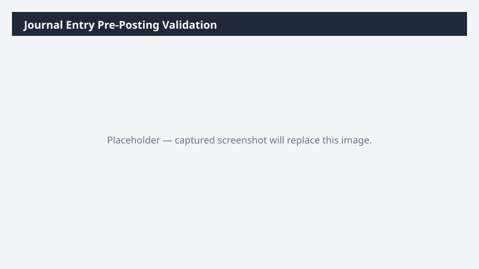

# Journal Entry Pre-Posting Validation

Validates open journal entries against a configurable rule set before posting and produces an exception report.

## What it does

Reads open journals and runs validation rules. Output is a workbook of exceptions for the GL team to triage.

## Prerequisites

- Dynamics 365 F&SCM access with the General ledger user role
- Cowork D365 ERP plugin enabled

## Step-by-step

1. Open Cowork and paste the prompt.
2. Approve the read-only data access.
3. Review the exceptions sheet; resolve in D365 before posting.

## Expected output

One workbook with one row per failing journal line and the rule that failed.

## Skills used

OOTB: Excel
Plugin actions: dynamics-365-erp/trial-balance-query

## License

CC-BY-4.0 — see repo `LICENSE`.
