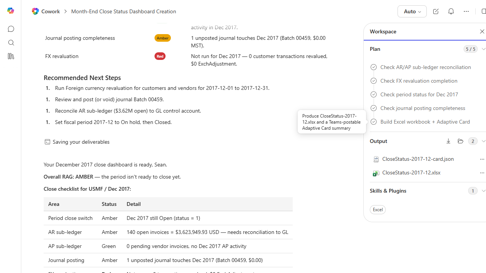

# Month-End Close Status Dashboard

Builds a one-page status dashboard summarizing where each close task stands as of today.

> ℹ **Tenant data caveat.** Validated end-to-end against a live Cowork tenant on 2026-05-23 with USMF for December 2017. Cowork executed all 5 plan steps and produced two artifacts: CloseStatus-2017-12.xlsx (Dashboard + 5 supporting sheets) and CloseStatus-2017-12-card.json (Adaptive Card JSON ready to post to a Teams channel). Real RAG status: Overall AMBER. Findings: Period close switch Amber (Dec 2017 still Open, status=1); AR sub-ledger Amber (140 open invoices, $3.62M open, needs reconciliation to GL); AP sub-ledger Green (0 pending vendor invoices, no Dec 2017 AP activity); Journal posting Amber (Batch 00459 unposted, $0.00 MST); FX revaluation Red (not run, 0 transactions revalued). Concrete recommended steps included with specific batch/account references.

## Business value

Replaces 'where are we on close?' standup chatter with a glanceable RAG dashboard the finance lead can post to Teams.

## What it does

Builds an at-a-glance close status workbook and an Adaptive Card summary ready to be posted.

## Prerequisites

- Dynamics 365 F&SCM read access

## Step-by-step

1. Open Cowork and paste the prompt.
2. Review the Adaptive Card before sharing in Teams.

## Expected output

One workbook and one Adaptive Card draft.

## Skills used

OOTB: Excel, Adaptive Cards
Plugin actions: dynamics-365-erp/data_find_entity_type, dynamics-365-erp/data_find_entities_sql

## License

CC-BY-4.0 — see repo `LICENSE`.
