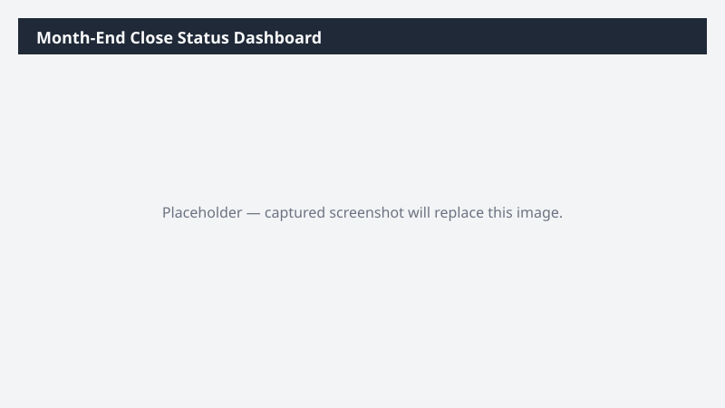

# Month-End Close Status Dashboard

Builds a one-page status dashboard summarizing where each close task stands as of today.

> ⚠ **Draft recipe — not yet verified.** The prompt, OOTB skill list, and plugin actions named below are starter content. No one has run this against a live Cowork tenant with the Dynamics 365 ERP plugin yet. Plugin action ids may not match Microsoft's actual published surface. Validate before relying on it.

## What it does

Builds an at-a-glance close status workbook and an Adaptive Card summary ready to be posted.

## Prerequisites

- Dynamics 365 F&SCM read access

## Step-by-step

1. Open Cowork and paste the prompt.
2. Review the Adaptive Card before sharing in Teams.

## Expected output

One workbook and one Adaptive Card draft.

## Skills used

OOTB: Excel, Adaptive Cards
Plugin actions: dynamics-365-erp/trial-balance-query

## License

CC-BY-4.0 — see repo `LICENSE`.
