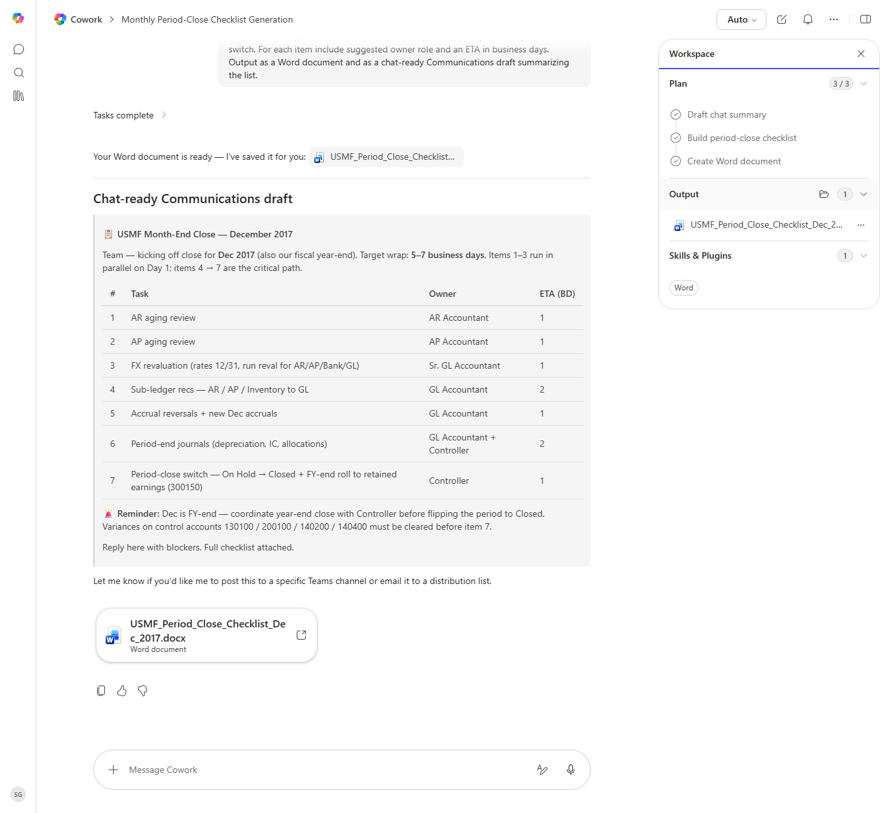

# Period Close Checklist Generator

Generates a tailored period-close checklist with item owners and ETA estimates based on the active legal entity's configuration.

> ℹ **Tenant data caveat.** Validated end-to-end against a live Cowork tenant on 2026-05-23 with USMF Dec 2017 (also USMF's fiscal year-end). Cowork ran all three plan steps and produced both 'USMF_Period_Close_Checklist_Dec_2017.docx' AND a chat-ready Communications draft. The 7-task table includes AR aging review (AR Accountant, 1bd), AP aging review (AP Accountant, 1bd), FX revaluation (Sr. GL Accountant, 1bd), Sub-ledger recs (GL Accountant, 2bd), Accrual reversals (GL Accountant, 1bd), Period-end journals (GL Accountant + Controller, 2bd), and Period-close switch (Controller, 1bd). Cowork added a sharp FY-end reminder: 'coordinate year-end close with Controller before flipping the period to Closed; variances on control accounts 130100 / 200100 / 140200 / 140400 must be cleared before item 7'.

## Business value

Standardizes the close calendar so nothing slips, and gives the controller a single-page view to chase owners across legal entities.

## What it does

Produces a tailored period-close checklist as both a Word document and a Communications-ready summary.

## Prerequisites

- Dynamics 365 F&SCM read access
- Cowork D365 ERP plugin enabled

## Step-by-step

1. Open Cowork and paste the prompt.
2. Review the produced checklist and customize for your team.

## Expected output

One Word document and one Communications summary.

## Skills used

OOTB: Word, Email, Communications
Plugin actions: dynamics-365-erp/data_find_entity_type, dynamics-365-erp/data_find_entities_sql

## License

CC-BY-4.0 — see repo `LICENSE`.
