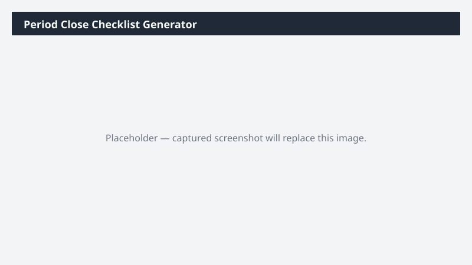

# Period Close Checklist Generator

Generates a tailored period-close checklist with item owners and ETA estimates based on the active legal entity's configuration.

> ⚠ **Draft recipe — not yet verified.** The prompt, OOTB skill list, and plugin actions named below are starter content. No one has run this against a live Cowork tenant with the Dynamics 365 ERP plugin yet. Validate before relying on it.

## Business value

Standardizes the close calendar so nothing slips, and gives the controller a single-page view to chase owners across legal entities.

## What it does

Produces a tailored period-close checklist as both a Word document and a Communications-ready summary.

## Prerequisites

- Dynamics 365 F&SCM read access
- Cowork D365 ERP plugin enabled

## Step-by-step

1. Open Cowork and paste the prompt.
2. Review the produced checklist and customize for your team.

## Expected output

One Word document and one Communications summary.

## Skills used

OOTB: Word, Email, Communications
Plugin actions: dynamics-365-erp/data_find_entity_type, dynamics-365-erp/data_find_entities_sql

## License

CC-BY-4.0 — see repo `LICENSE`.
