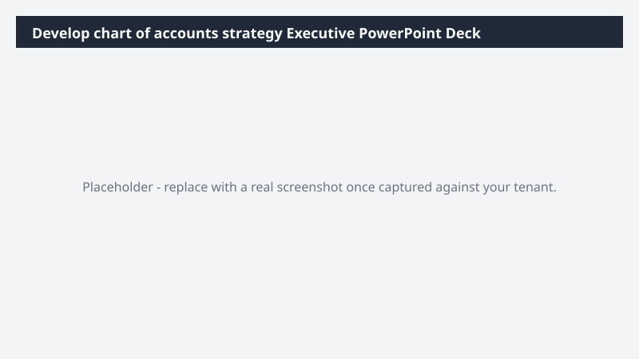

# Develop chart of accounts strategy Executive PowerPoint Deck

Generates an executive-ready PowerPoint deck on develop chart of accounts strategy status, complete with charts and talking-point notes.

> ⚠ **Draft recipe — not yet verified.** Generated by the bulk catalog generator to ensure every Business Process Catalog process has at least one recipe. The prompt below uses the real D365 ERP MCP tool surface and the USMF tenant data conventions, but no one has run this against a live Cowork tenant yet. Validate before relying on it.

## Business value

Cuts deck prep time from hours to minutes for develop chart of accounts strategy reviews while ensuring the numbers in the slides match D365 to the cent.

## What it does

Reads develop chart of accounts strategy data and produces a 6-8 slide PowerPoint suitable for an executive review.

## Prerequisites

- Dynamics 365 F&SCM access with the appropriate role
- Cowork D365 ERP plugin enabled

## Step-by-step

1. Open Cowork and confirm the Dynamics 365 ERP plugin is toggled on for your session.
2. Paste the prompt from `prompt.md` into a new task.
3. Review the generated output and adjust scope as needed.

## Expected output

See the prompt for the specific deliverable(s). All generated files land in `Documents/Cowork/output/` in OneDrive.

## Skills used

OOTB: PowerPoint, Excel
Plugin actions: dynamics-365-erp/data_find_entity_type, dynamics-365-erp/data_find_entities_sql

## License

CC-BY-4.0 — see repo `LICENSE`.
