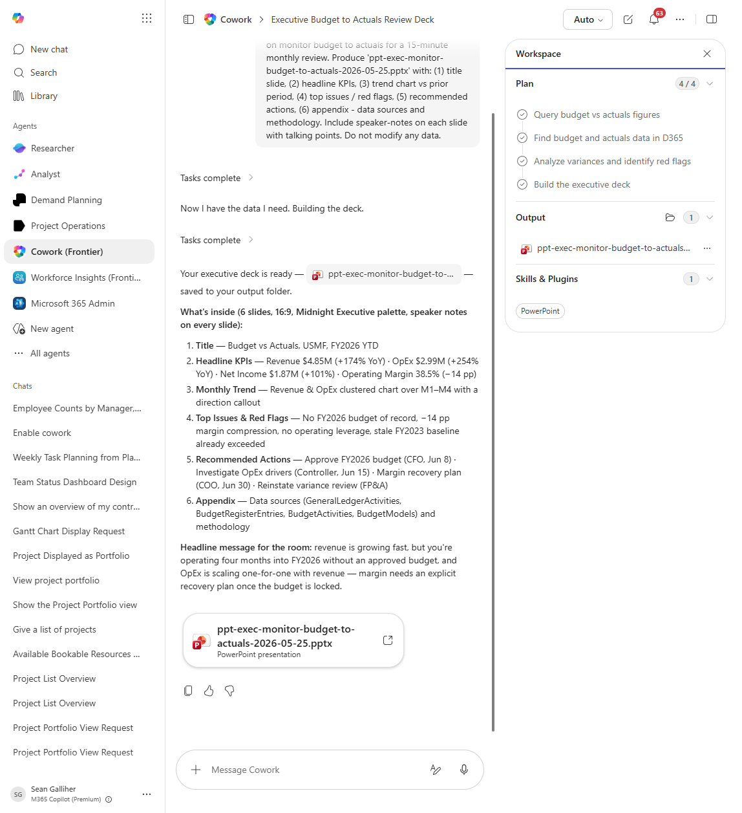

# Monitor budget to actuals Executive PowerPoint Deck

Generates an executive-ready PowerPoint deck on monitor budget to actuals status, complete with charts and talking-point notes.

## Business value

Cuts deck prep time from hours to minutes for monitor budget to actuals reviews while ensuring the numbers in the slides match D365 to the cent.

## What it does

Reads monitor budget to actuals data and produces a 6-8 slide PowerPoint suitable for an executive review.

## Prerequisites

- Dynamics 365 F&SCM access with the appropriate role
- Cowork D365 ERP plugin enabled

## Step-by-step

1. Open Cowork and confirm the Dynamics 365 ERP plugin is toggled on for your session.
2. Paste the prompt from `prompt.md` into a new task.
3. Review the generated output and adjust scope as needed.

## Expected output

See the prompt for the specific deliverable(s). All generated files land in `Documents/Cowork/output/` in OneDrive.

## Skills used

OOTB: PowerPoint, Excel
Plugin actions: dynamics-365-erp/data_find_entity_type, dynamics-365-erp/data_find_entities_sql

## License

CC-BY-4.0 — see repo `LICENSE`.
