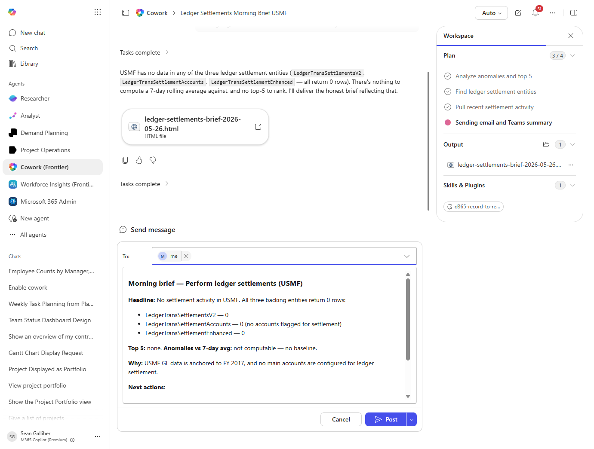

# Perform ledger settlements Scheduled Email Brief

Schedulable morning-brief email summarizing perform ledger settlements for the responsible owner; designed to run daily or weekly.

## Business value

Replaces a daily manual spreadsheet stitch with an automatic brief so owners walk into standup already knowing where perform ledger settlements stands.

## What it does

Reads perform ledger settlements, computes a short brief, drafts an email, and is a strong candidate for a Cowork scheduled task.

## Prerequisites

- Dynamics 365 F&SCM access with the appropriate role
- Cowork D365 ERP plugin enabled

## Step-by-step

1. Open Cowork and confirm the Dynamics 365 ERP plugin is toggled on for your session.
2. Paste the prompt from `prompt.md` into a new task.
3. Review the generated output and adjust scope as needed.

## Expected output

See the prompt for the specific deliverable(s). All generated files land in `Documents/Cowork/output/` in OneDrive.

## Skills used

OOTB: Email, Communications
Plugin actions: dynamics-365-erp/data_find_entity_type, dynamics-365-erp/data_find_entities_sql

## License

CC-BY-4.0 — see repo `LICENSE`.
