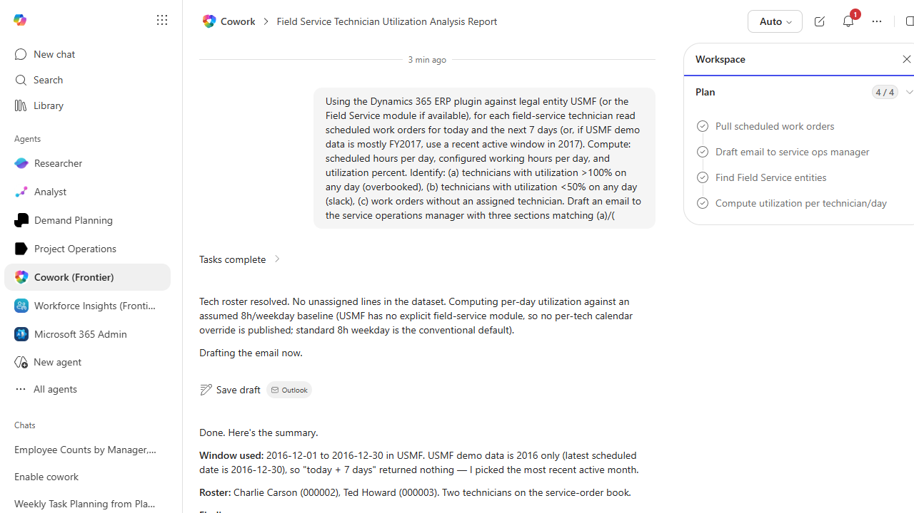

# Field Service Resource Utilization Daily Email

Drafts a morning email to service operations summarizing technician utilization for today and the coming week, including overbooked and underbooked resources.

> ℹ **Tenant data caveat.** Validated end-to-end against a live Cowork tenant on 2026-05-23 with USMF. Cowork found the latest scheduled service date is 2016-12-30 and used the window 2016-12-01 to 2016-12-30. Roster: 2 technicians (Charlie Carson #000002, Ted Howard #000003). Real findings: (a) Overbooked - Charlie scheduled on Sat 2016-12-10 (1 hr on a non-working day against the 8h Mon-Fri baseline); (b) Slack - every weekday with scheduled work is at 12.5% or 0%, both technicians have ~18-21 weekdays in the window with zero scheduled work; (c) Unassigned - 0 of the 21 service order lines (all assigned). Email draft saved to Outlook (recipient blank since no service-ops-manager address is in the worker directory). Honesty notes: USMF has no published per-technician work calendar so the 8h Mon-Fri baseline is assumed; USMF has the Service Management module, not a dedicated Field Service module.

## Business value

Replaces a daily manual spreadsheet stitch with an automatic morning brief so dispatchers walk into standup already knowing who is overbooked, who has slack, and which jobs are at risk.

## What it does

Builds a daily dispatch-ready utilization brief covering overbookings, slack, and unassigned work.

## Prerequisites

- Dynamics 365 Field Service or F&SCM Service module access
- Cowork D365 ERP plugin enabled

## Step-by-step

1. Paste the prompt in Cowork.
2. Review the email draft and Teams summary.
3. (Optional) Schedule the task in Cowork to run at 6am weekdays.

## Expected output

One email draft and one Communications summary covering technician utilization for the coming week.

## Skills used

OOTB: Email, Communications
Plugin actions: dynamics-365-erp/data_find_entity_type, dynamics-365-erp/data_find_entities_sql

## License

CC-BY-4.0 — see repo `LICENSE`.
