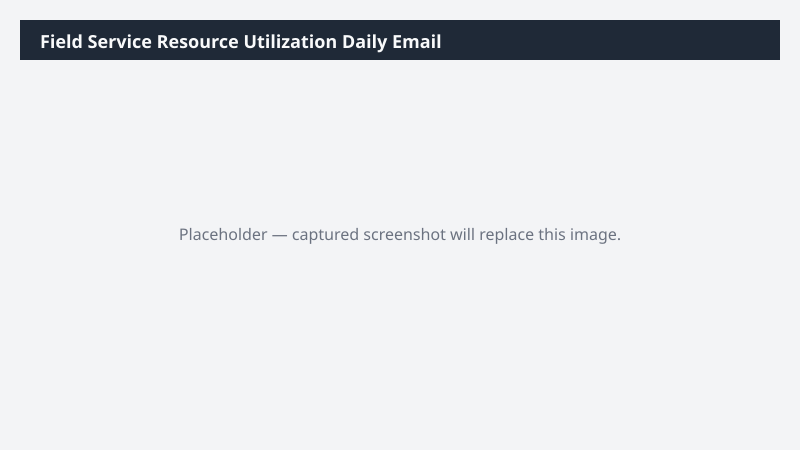

# Field Service Resource Utilization Daily Email

Drafts a morning email to service operations summarizing technician utilization for today and the coming week, including overbooked and underbooked resources.

> ⚠ **Draft recipe — not yet verified.** The prompt, OOTB skill list, and plugin actions named below are starter content. No one has run this against a live Cowork tenant with the Dynamics 365 ERP plugin yet. Validate before relying on it.

## Business value

Replaces a daily manual spreadsheet stitch with an automatic morning brief so dispatchers walk into standup already knowing who is overbooked, who has slack, and which jobs are at risk.

## What it does

Builds a daily dispatch-ready utilization brief covering overbookings, slack, and unassigned work.

## Prerequisites

- Dynamics 365 Field Service or F&SCM Service module access
- Cowork D365 ERP plugin enabled

## Step-by-step

1. Paste the prompt in Cowork.
2. Review the email draft and Teams summary.
3. (Optional) Schedule the task in Cowork to run at 6am weekdays.

## Expected output

One email draft and one Communications summary covering technician utilization for the coming week.

## Skills used

OOTB: Email, Communications
Plugin actions: dynamics-365-erp/data_find_entity_type, dynamics-365-erp/data_find_entities_sql

## License

CC-BY-4.0 — see repo `LICENSE`.
