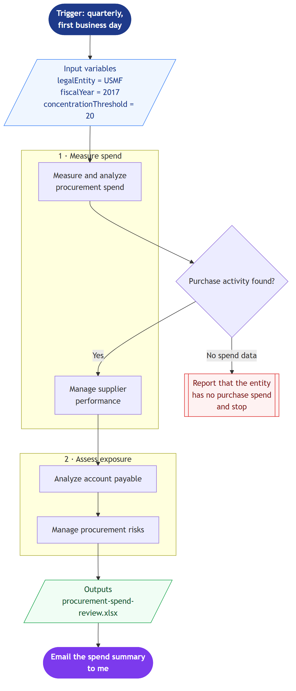

# Procurement Spend & Supplier Risk Blueprint

Paste this procurement-analysis workflow blueprint into Cowork and it profiles spend by vendor, flags concentration risk, and surfaces payable exposure.

> ⚠ **Draft recipe — not yet verified.** The blueprint below is generated from the Business Process Catalog but has not been run against a live Cowork tenant. Validate before relying on it.

## Business value

Shows where spend is concentrated in a handful of suppliers before that concentration becomes a continuity problem, and does it without waiting on a BI request.

## How to run it

1. Open a new Cowork task and turn the **Dynamics 365 ERP** plugin toggle on.
2. Paste the blueprint image below into the message.
3. Paste the prompt from `prompt.md` into the **same** message.
4. Send. Cowork reads the diagram for structure and the prompt for values.

## Blueprint

Mermaid source: [`blueprint.mmd`](blueprint.mmd)

## Process phases

1. **Measure spend** — Measure and analyze procurement spend, Manage supplier performance
2. **Assess exposure** — Analyze account payable, Manage procurement risks

Derived from the Microsoft Business Process Catalog area **Analyze procurement and sourcing** (`source-to-pay/analyze-procurement-and-sourcing`).

## Input bindings

| Variable | Value | Meaning |
| --- | --- | --- |
| `legalEntity` | USMF | Legal entity to scope every query to. |
| `fiscalYear` | 2017 | Year to profile. USMF posted activity is mostly FY2017. |
| `concentrationThreshold` | 20 | Percent of total spend with one vendor that flags concentration risk. |

## Guardrails

- Read only. Do not create or modify vendors, purchase orders, or invoices.
- Produce the workbook in this run — do not return a plan or a methodology document instead.
- Report concentration and exposure; leave every sourcing decision to me.

## Expected output

One workbook plus an email draft. This is the blueprint most likely to hit the halt node — USMF carries zero VendorInvoiceHeader records, so a clean 'no spend data' report is the correct outcome and is itself the deliverable.

## Prerequisites

- Dynamics 365 F&SCM access with the Procurement and Accounts payable roles
- Cowork D365 ERP plugin toggled on in the session

## Skills used

OOTB: Excel, Email

Plugin actions: dynamics-365-erp/data_find_entity_type, dynamics-365-erp/data_find_entities_sql

## License

CC-BY-4.0 — see repo `LICENSE`.
