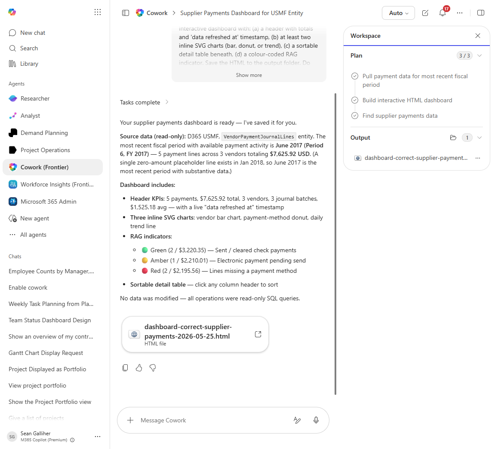

# Correct supplier payments Interactive HTML Dashboard

Produces a self-contained interactive HTML dashboard for correct supplier payments - opens in any browser, no D365 access needed by the viewer.

## Business value

Lets ops leadership share a live-looking view of correct supplier payments with executives and customers without granting D365 logins.

## What it does

Builds a single-file HTML dashboard with inline SVG/d3 charts visualizing correct supplier payments.

## Prerequisites

- Dynamics 365 F&SCM access with the appropriate role
- Cowork D365 ERP plugin enabled

## Step-by-step

1. Open Cowork and confirm the Dynamics 365 ERP plugin is toggled on for your session.
2. Paste the prompt from `prompt.md` into a new task.
3. Review the generated output and adjust scope as needed.

## Expected output

See the prompt for the specific deliverable(s). All generated files land in `Documents/Cowork/output/` in OneDrive.

## Skills used

OOTB: PDF
Plugin actions: dynamics-365-erp/data_find_entity_type, dynamics-365-erp/data_find_entities_sql

## License

CC-BY-4.0 — see repo `LICENSE`.
