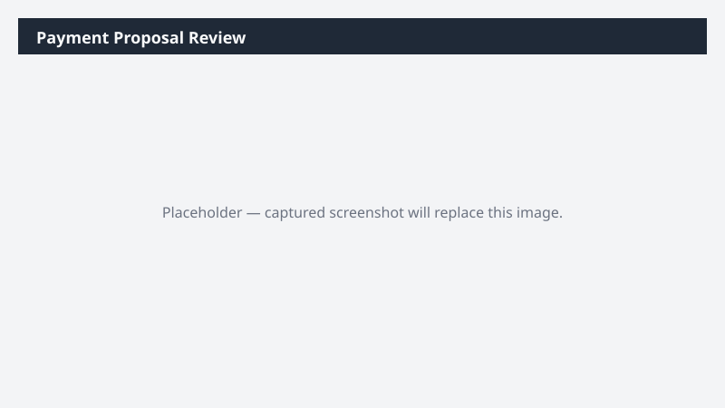

# Payment Proposal Review

Reviews the current payment proposal for accuracy and flags lines that need attention before release.

## What it does

Sanity-checks a payment proposal before release.

## Prerequisites

- Dynamics 365 F&SCM access with the Accounts payable role

## Step-by-step

1. Paste the prompt.
2. Review the workbook with the AP manager before releasing the proposal in D365.

## Expected output

Workbook with flagged proposal lines by category.

## Skills used

OOTB: Excel
Plugin actions: dynamics-365-erp/payment-proposal-query

## License

CC-BY-4.0 — see repo `LICENSE`.
