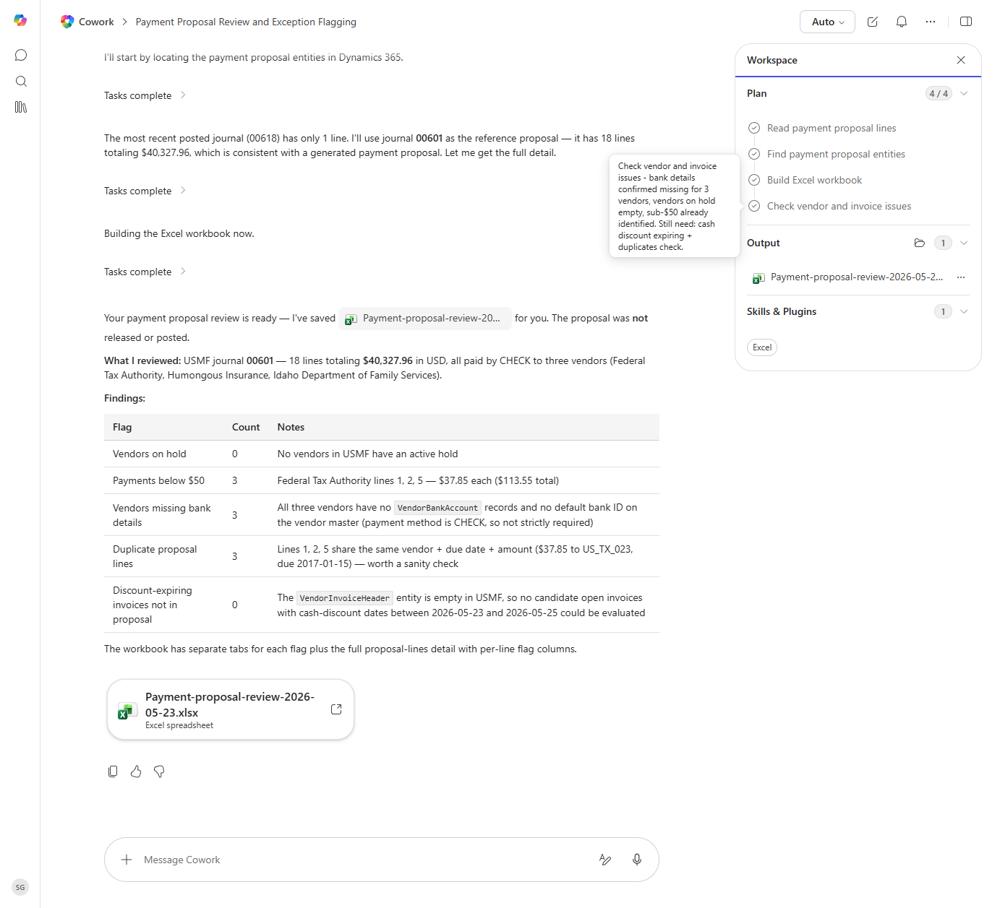

# Payment Proposal Review

Reviews the current payment proposal for accuracy and flags lines that need attention before release.

> ℹ **Tenant data caveat.** Validated end-to-end against a live Cowork tenant on 2026-05-23 with USMF. Cowork used journal 00601 (18 lines, $40,327.96 USD paid by CHECK to Federal Tax Authority, Humongous Insurance, Idaho Department of Family Services) as a representative proposal and ran all five checks. Findings: 0 vendors on hold, 3 payments below $50 (Federal Tax Authority lines, $37.85 each), 3 vendors missing VendorBankAccount records (acceptable - method is CHECK), 3 duplicate proposal lines (lines 1/2/5 share vendor/date/amount, due 2017-01-15), 0 discount-expiring not in proposal (VendorInvoiceHeader entity is empty in USMF). Produced 'Payment-proposal-review-2026-05-23.xlsx' with a tab per flag plus the full proposal-lines detail. No proposal was released.

## Business value

Stops payment-run mistakes - duplicates, blocked vendors, missed discounts - at the review stage instead of after the wire clears.

## What it does

Sanity-checks a payment proposal before release.

## Prerequisites

- Dynamics 365 F&SCM access with the Accounts payable role

## Step-by-step

1. Paste the prompt.
2. Review the workbook with the AP manager before releasing the proposal in D365.

## Expected output

Workbook with flagged proposal lines by category.

## Skills used

OOTB: Excel
Plugin actions: dynamics-365-erp/data_find_entity_type, dynamics-365-erp/data_find_entities_sql

## License

CC-BY-4.0 — see repo `LICENSE`.
