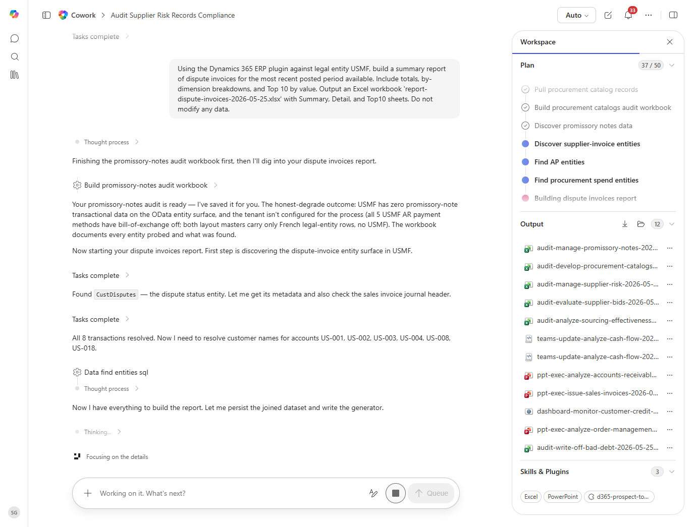

# Dispute invoices Summary Report

Builds a structured summary report of dispute invoices activity with totals, trends, and breakdowns.

## Business value

Gives leadership a fast, repeatable view of where dispute invoices stands so decisions are made on facts rather than spreadsheet stitches.

## What it does

Reads dispute invoices records, computes summary statistics and groupings, and emits an Excel report.

## Prerequisites

- Dynamics 365 F&SCM access with the appropriate role
- Cowork D365 ERP plugin enabled

## Step-by-step

1. Open Cowork and confirm the Dynamics 365 ERP plugin is toggled on for your session.
2. Paste the prompt from `prompt.md` into a new task.
3. Review the generated output and adjust scope as needed.

## Expected output

See the prompt for the specific deliverable(s). All generated files land in `Documents/Cowork/output/` in OneDrive.

## Skills used

OOTB: Excel
Plugin actions: dynamics-365-erp/data_find_entity_type, dynamics-365-erp/data_find_entities_sql

## License

CC-BY-4.0 — see repo `LICENSE`.
