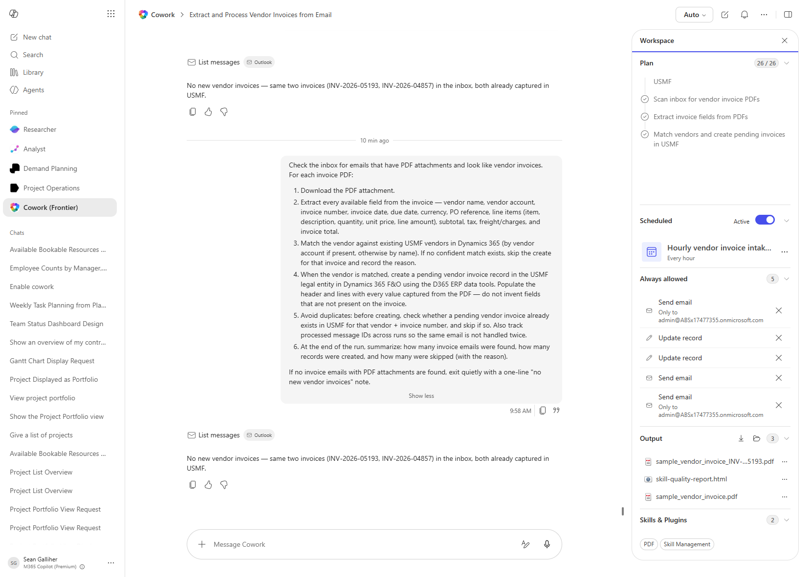

# Vendor Invoice Capture from Email

Watches the inbox for emails with PDF attachments that look like vendor invoices, extracts every field from the PDF, matches the vendor against USMF master data, and creates a pending vendor invoice record in Dynamics 365 F&O with the header and lines populated.

> ⚠ **This recipe modifies Dynamics 365 data.** Run it in a sandbox tenant first and review the proposed changes before approving any write action. The prompt creates *pending* vendor invoice headers and lines so an AP reviewer still controls posting, but those records will appear in the workspace and need to be cleaned up if you are only testing.

## Business value

Shrinks vendor-invoice intake from a manual data-entry chore to an unattended inbox scan. Each captured PDF becomes a pending invoice in USMF with header + lines pre-filled, so AP only reviews and approves instead of keying. Duplicate detection and message-ID tracking keep the same invoice from being booked twice.

## What it does

On every run the recipe:

1. Scans the connected mailbox for emails with PDF attachments that look like vendor invoices.
2. Downloads each PDF and extracts vendor identity, header dates and totals, currency, PO reference, and full line detail (item, description, quantity, unit price, line amount).
3. Matches the extracted vendor against USMF vendors in D365 (by vendor account first, then by name). If no confident match exists, the create is skipped and the reason recorded.
4. Creates a pending `VendorInvoiceHeader` plus matching `VendorInvoiceLine` rows in USMF — populating only fields actually present on the PDF.
5. Guards against duplicates two ways — a pre-create lookup on vendor + invoice number, and a persisted set of processed message IDs across runs.
6. Emits a run summary: emails found, records created, and skips with reasons.

If the inbox has no new invoice emails the recipe exits with a one-line `no new vendor invoices` note so scheduled runs stay quiet.

## Prerequisites

- Cowork session signed in with mailbox access (Outlook plugin)
- Cowork D365 ERP plugin enabled and pointed at USMF
- PDF parsing skill enabled in the session
- Optional — Cowork scheduled task to run this prompt hourly so capture is unattended

## Step-by-step

1. Open a fresh Cowork task and paste the prompt body verbatim.
2. (Optional) Configure a Cowork scheduled task — `Hourly vendor invoice intake` is the pattern used in the verification run — so the recipe runs unattended every hour.
3. Approve the always-allowed actions list on the first run (Send email, Update record). After approval the recipe runs unattended.
4. Inspect the Output panel for the extracted PDF copy and the run summary card.
5. Open USMF → Accounts payable → Vendor invoices → Pending vendor invoices and confirm the new header and lines.

## Expected output

A run summary of the form:

> **Vendor invoice intake — INV-2026-05193**
> - **1 new invoice email found** — Contoso Office Supplies, Inc. (vendor US-111), invoice INV-2026-05193 dated 2026-06-04.
> - **1 record created in USMF** — pending vendor invoice header `INV-2026-05193-US111` plus all 6 line items, with quantities, unit prices, and descriptions captured from the PDF.
> - **0 skipped as new** (prior copies were already booked and were skipped as duplicates, as expected).

Subsequent runs with no new invoices return only:

> `No new vendor invoices — same invoices already captured in USMF.`

## Skills used

OOTB: Email, PDF
Plugin actions: dynamics-365-erp/data_find_entity_type, dynamics-365-erp/data_get_entity_metadata, dynamics-365-erp/data_find_entities_sql, dynamics-365-erp/data_create_entities
Custom skill: vendor-invoice-capture

## License

CC-BY-4.0 — see repo `LICENSE`.
