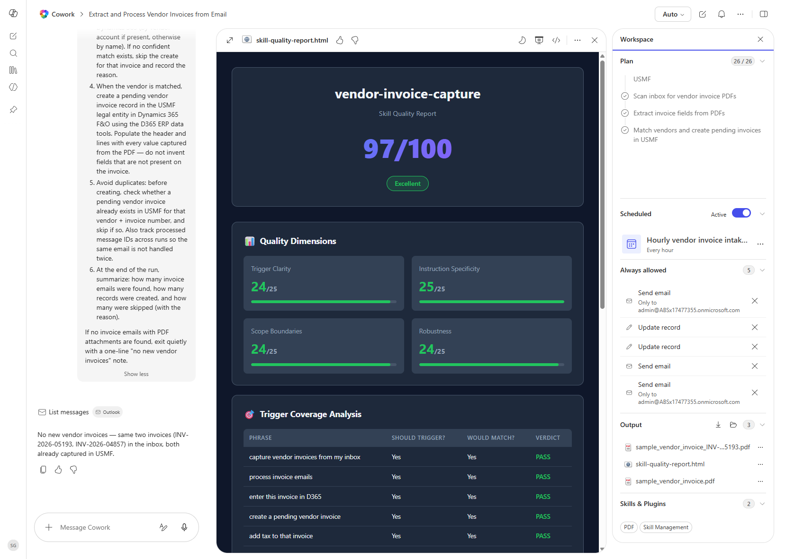

# Vendor Invoice Capture Skill (packaged + scored)

The packaged Cowork skill that powers the vendor-invoice intake recipe — runs the PDF extraction, USMF vendor match, and pending invoice creation as a single reusable skill, with a 97/100 quality scorecard from the Cowork skill quality tool.

> ⚠ **This skill modifies Dynamics 365 data.** It creates pending vendor invoice headers and lines in USMF. Run it in a sandbox before turning it loose on a production tenant.

## Business value

Lets you ship the vendor-invoice intake workflow as a reusable Cowork skill instead of pasting a long prompt every time. The Skill Management quality report (97/100, **Excellent**) covers trigger clarity, instruction specificity, scope boundaries, and robustness — so AP and IT can adopt the skill knowing it passes Cowork's skill-quality gates.

## What it does

`vendor-invoice-capture` is a packaged Cowork skill that wraps the [Vendor Invoice Capture from Email](../vendor-invoice-capture-from-email/) workflow into a reusable trigger:

- A short list of natural trigger phrases (capture vendor invoices, process invoice emails, enter this invoice in D365, create a pending vendor invoice, add tax to that invoice).
- A scoped instruction body covering inbox scan, PDF extraction, USMF vendor match, duplicate guard, pending invoice create, and run summary.
- A robustness story that handles the empty-inbox case quietly and skips invoices whose vendor cannot be matched in USMF.

The skill's quality scorecard:

| Dimension | Score |
| --- | --- |
| Trigger Clarity | 24 / 25 |
| Instruction Specificity | 25 / 25 |
| Scope Boundaries | 24 / 25 |
| Robustness | 24 / 25 |
| **Total** | **97 / 100 — Excellent** |

The Trigger Coverage Analysis confirms five common phrasings (capture vendor invoices from my inbox, process invoice emails, enter this invoice in D365, create a pending vendor invoice, add tax to that invoice) all resolve to this skill.

## Prerequisites

- Cowork Skill Management enabled in the session
- Cowork D365 ERP plugin enabled and pointed at USMF
- PDF parsing skill enabled in the session
- Outlook plugin enabled with mailbox read access

## Step-by-step

1. Install the `vendor-invoice-capture` skill in your Cowork environment (or import it from the cookbook repo into Skill Management).
2. Run the Cowork Skill Quality Report tool against the skill to confirm the score (expect 97/100 with the shipped definition).
3. Invoke the skill conversationally — any of the trigger phrases above will hand off to it.
4. (Optional) Wire the skill into a scheduled Cowork task so it runs hourly without human prompting.
5. Inspect the run summary in the chat output and confirm the new pending invoices in USMF (Accounts payable → Vendor invoices → Pending vendor invoices).

## Expected output

After invocation, Cowork hands off to the packaged skill, executes the full workflow against the live mailbox + USMF, and returns:

- A run summary card listing emails found, records created, and skips with reasons.
- Output artifacts in the workspace panel (extracted PDFs, generated reports).
- A Skill Quality Report (HTML) you can open from the Output panel to confirm the 97/100 score.

## Skills used

OOTB: Email, PDF
Plugin actions: dynamics-365-erp/data_find_entity_type, dynamics-365-erp/data_get_entity_metadata, dynamics-365-erp/data_find_entities_sql, dynamics-365-erp/data_create_entities
Custom skill: vendor-invoice-capture

## License

CC-BY-4.0 — see repo `LICENSE`.
