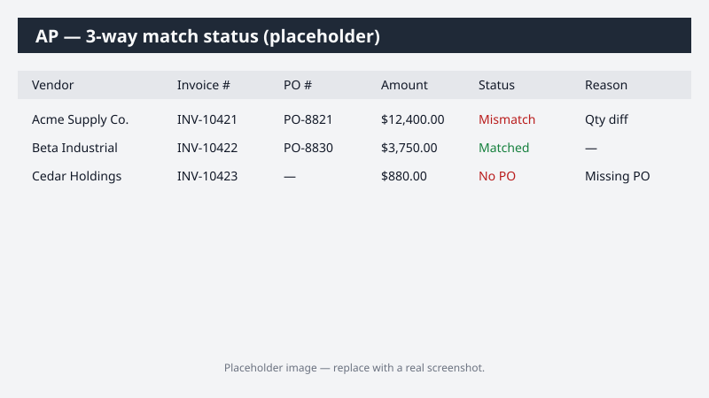

# Vendor Invoice Three-Way Match Status Report

Builds a status report of recent vendor invoices and their three-way-match state against the corresponding purchase orders and goods receipts. The output is a formatted Excel workbook plus a draft email to the AP team.

> ⚠ **Draft recipe — not yet verified.** The prompt, OOTB skill list, and Dynamics 365 ERP plugin action ids below are starter content. No one has run this against a live Cowork tenant yet. Validate before relying on it.

This recipe is **read-only** — it does not modify any data in Dynamics 365.

## What it does

1. Queries the Dynamics 365 F&SCM accounts payable subledger for the last 30 days of vendor invoices.
2. For each invoice, resolves the linked PO header and the goods receipt status.
3. Computes the three-way match state and the reason for any mismatch.
4. Builds an Excel workbook grouped by vendor with conditional formatting.
5. Drafts an email to the AP team summarizing the findings.

## Prerequisites

- Dynamics 365 F&SCM access with the **Accounts payable** role.
- The Cowork **Dynamics 365 ERP plugin** installed and signed in.
- A 30-day reporting window is reasonable for your tenant (adjust the prompt if you need longer).

## Step-by-step usage

1. Open Cowork.
2. Paste the prompt from `prompt.md` (use the **Copy prompt** button on the recipe page).
3. Cowork will load the **Dynamics 365 ERP** plugin and the **Excel** + **Email** out-of-the-box skills automatically. Approve the read-only data access when prompted.
4. Review the produced workbook in the side panel. It will be saved to your OneDrive Cowork output folder.
5. Review the email draft. Edit recipients before sending.

## Expected output

- An Excel file `AP-3way-match-status-<YYYY-MM-DD>.xlsx` with:
  - A **Summary** sheet (counts by mismatch reason, totals by vendor)
  - One sheet per vendor with mismatch rows highlighted
- A draft email to the AP team referencing the workbook.

## Troubleshooting

- **No invoices returned** — Verify the 30-day window covers a period with AP activity in your tenant; adjust the prompt to a wider window if needed.
- **Plugin not loaded** — Confirm the Dynamics 365 ERP plugin is installed via the Microsoft 365 App Store and that you've signed in to your D365 tenant inside Cowork.
- **Workbook didn't save** — Cowork output files land in `Documents/Cowork/output/` in OneDrive; check there before assuming a failure.

## Skills used

- Dynamics 365 ERP plugin → `vendor-invoice-query`
- Cowork OOTB **Excel** skill
- Cowork OOTB **Email** skill (draft only)

## License

CC-BY-4.0 — see repo `LICENSE`.
