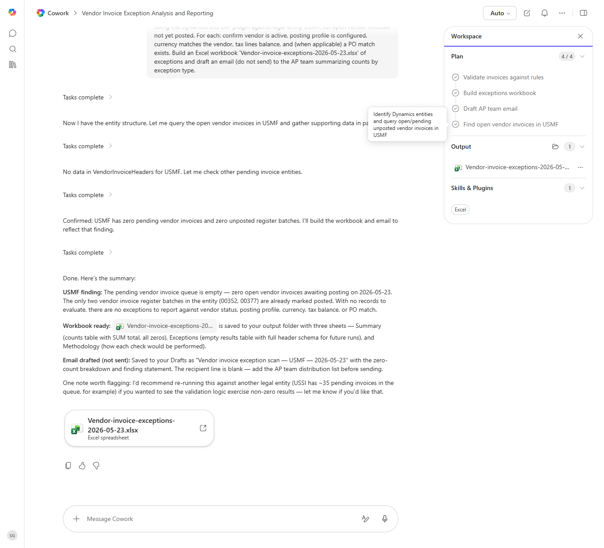

# Vendor Invoice Pre-Posting Validation

Validates open vendor invoices against posting rules and emails the AP team a fix-list.

> ℹ **Tenant data caveat.** Validated end-to-end against a live Cowork tenant on 2026-05-23 with USMF. Cowork ran all four plan steps and produced 'Vendor-invoice-exceptions-2026-05-23.xlsx' with three sheets (Summary, Exceptions, Methodology). USMF finding: zero open vendor invoices awaiting posting - both vendor invoice register batches (00352, 00377) are already marked posted. Cowork drafted a zero-finding AP team email (saved to Drafts, not sent) and helpfully noted that USSI has ~35 pending invoices if you want to see the validation logic exercise non-zero results.

## Business value

Avoids the back-and-forth of failed postings by surfacing posting blockers (inactive vendor, missing tax, PO mismatch) before AP releases the batch.

## What it does

Catches posting-blocker issues on vendor invoices before they get to the GL.

## Prerequisites

- Dynamics 365 F&SCM access with the Accounts payable role

## Step-by-step

1. Paste the prompt in Cowork.
2. Review the email draft and recipients before sending.

## Expected output

Workbook of invoices that would fail to post, and an email draft to the AP team.

## Skills used

OOTB: Excel, Email
Plugin actions: dynamics-365-erp/data_find_entity_type, dynamics-365-erp/data_find_entities_sql

## License

CC-BY-4.0 — see repo `LICENSE`.
