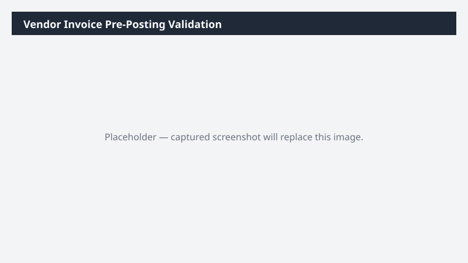

# Vendor Invoice Pre-Posting Validation

Validates open vendor invoices against posting rules and emails the AP team a fix-list.

> ⚠ **Draft recipe — not yet verified.** The prompt, OOTB skill list, and plugin actions named below are starter content. No one has run this against a live Cowork tenant with the Dynamics 365 ERP plugin yet. Plugin action ids may not match Microsoft's actual published surface. Validate before relying on it.

## What it does

Catches posting-blocker issues on vendor invoices before they get to the GL.

## Prerequisites

- Dynamics 365 F&SCM access with the Accounts payable role

## Step-by-step

1. Paste the prompt in Cowork.
2. Review the email draft and recipients before sending.

## Expected output

Workbook of invoices that would fail to post, and an email draft to the AP team.

## Skills used

OOTB: Excel, Email
Plugin actions: dynamics-365-erp/vendor-invoice-query

## License

CC-BY-4.0 — see repo `LICENSE`.
