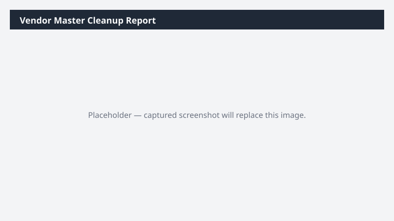

# Vendor Master Cleanup Report

Identifies duplicate, incomplete, or inactive vendors in the master record and proposes a cleanup plan.

## What it does

Finds dirty vendor records and suggests a triage list.

## Prerequisites

- Dynamics 365 F&SCM access with the Accounts payable role

## Step-by-step

1. Paste the prompt in Cowork.
2. Review the workbook; merge or update vendors directly in D365 as needed.

## Expected output

Workbook with categorized vendor-master issues.

## Skills used

OOTB: Excel
Plugin actions: dynamics-365-erp/vendor-master-query

## License

CC-BY-4.0 — see repo `LICENSE`.
