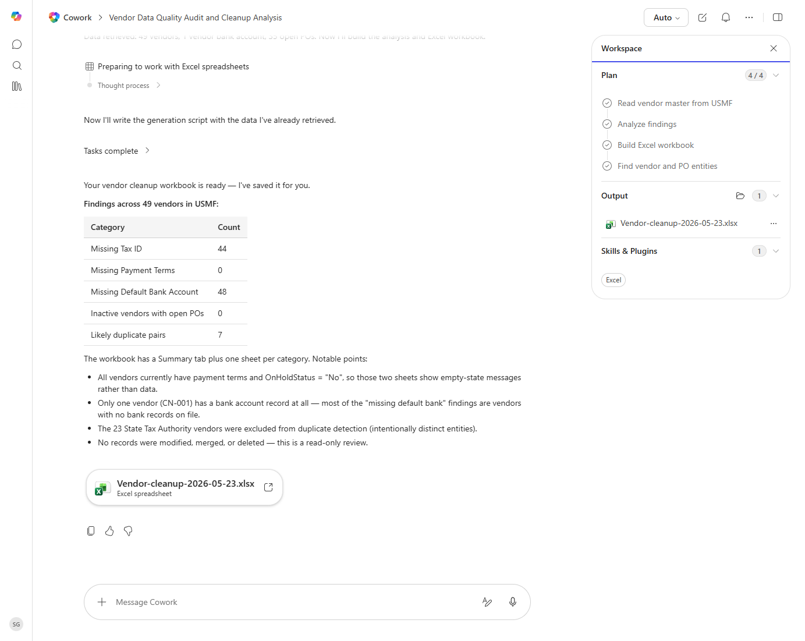

# Vendor Master Cleanup Report

Identifies duplicate, incomplete, or inactive vendors in the master record and proposes a cleanup plan.

> ℹ **Tenant data caveat.** Validated end-to-end against a live Cowork tenant on 2026-05-23 with USMF. Cowork queried 49 vendors via data_find_entities_sql, flagged 44 missing tax IDs, 48 missing default bank accounts, 0 missing payment terms, 0 inactive vendors with open POs, and 7 likely duplicate pairs (fuzzy name+tax+bank match). Produced 'Vendor-cleanup-2026-05-23.xlsx' with one sheet per finding category. No vendor records were modified.

## Business value

Reduces duplicate payments and tax-reporting errors by tightening the vendor master before bad data propagates into invoicing and 1099s.

## What it does

Finds dirty vendor records and suggests a triage list.

## Prerequisites

- Dynamics 365 F&SCM access with the Accounts payable role

## Step-by-step

1. Paste the prompt in Cowork.
2. Review the workbook; merge or update vendors directly in D365 as needed.

## Expected output

Workbook with categorized vendor-master issues.

## Skills used

OOTB: Excel
Plugin actions: dynamics-365-erp/data_find_entity_type, dynamics-365-erp/data_find_entities_sql

## License

CC-BY-4.0 — see repo `LICENSE`.
