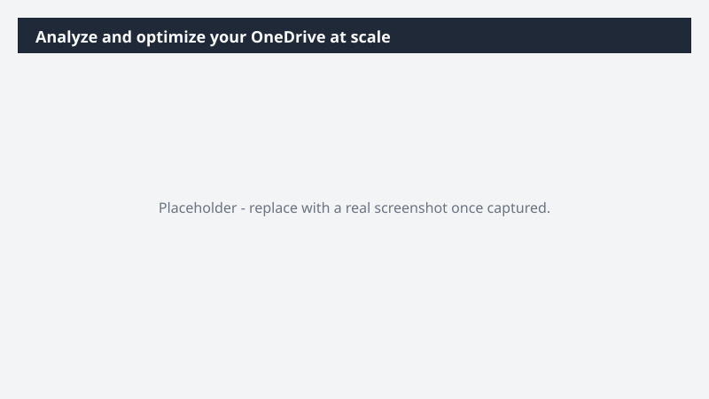

# Analyze and optimize your OneDrive at scale

Turn a sprawling OneDrive into a structured catalog you can actually act on.

> ⚠ **Draft recipe — not yet verified.** This prompt is reproduced from the Microsoft Copilot Cowork Task Pack for All Functions. It has not been run against our tenant, so the output described below is the pack's stated expectation rather than an observed result. Validate before relying on it.

## Business value

Turn a sprawling OneDrive into a structured catalog you can actually act on. An organization plan and visual overview of your files - with cleanup decisions queued up for your approval.

## What it does

An organization plan and visual overview of your files - with cleanup decisions queued up for your approval.

## Prerequisites

- Microsoft 365 Copilot licence with access to Cowork

## Step-by-step

1. Open Cowork and start a new task.
2. Paste the prompt from `prompt.md`, replacing anything in square brackets with your own values.
3. Review the plan Cowork proposes before letting it run.
4. Check any drafted email or calendar change before approving it — the prompt holds them for review rather than sending.

## How Cowork works through it

1. OneDrive → Scan file inventory
2. Catalog → Age + relevance
3. Categorize → Customer / product
4. Visualize → HTML dashboard
5. Recommend → Optimization plan
6. Rename → "Delete_" files
7. Approve → Re-org actions

## Expected output

An organization plan and visual overview of your files - with cleanup decisions queued up for your approval.

## Source

Adapted from the **Microsoft Copilot Cowork Task Pack for All Functions**, a task pack Microsoft publishes for customers. The prompt is reproduced as published; the surrounding recipe metadata, process tagging, and guidance are the Cookbook's.

## Skills used

OOTB: PowerPoint

Plugin: none required

## License

CC-BY-4.0 — see repo `LICENSE`.
