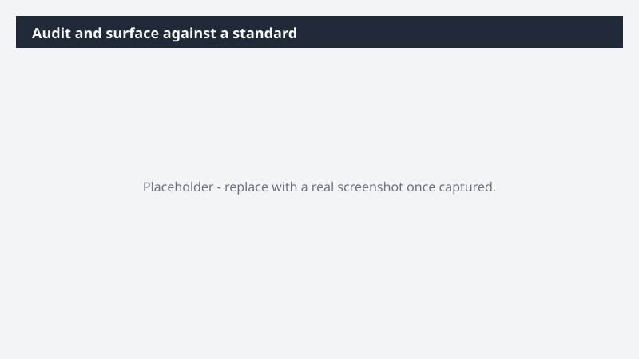

# Audit and surface against a standard

Apply a brand guide, naming convention, compliance policy, or quality standard across dozens of files - without manually reviewing each one and without risking accidental changes.

> ⚠ **Draft recipe — not yet verified.** This prompt is reproduced from the Microsoft Copilot Cowork Task Pack for All Functions. It has not been run against our tenant, so the output described below is the pack's stated expectation rather than an observed result. Validate before relying on it.

> **Tip.** Note: This task pairs bulk reading with safety - Cowork doesn't change any files. It surfaces a complete action list so you can prioritize manual cleanup.

## Business value

Apply a brand guide, naming convention, compliance policy, or quality standard across dozens of files - without manually reviewing each one and without risking accidental changes. A sortable audit report showing every violation, its severity, and a recommended fix - so you can prioritize manual cleanup confidently.

## What it does

A sortable audit report showing every violation, its severity, and a recommended fix - so you can prioritize manual cleanup confidently.

## Prerequisites

- Microsoft 365 Copilot licence with access to Cowork

## Step-by-step

1. Open Cowork and start a new task.
2. Paste the prompt from `prompt.md`, replacing anything in square brackets with your own values.
3. Review the plan Cowork proposes before letting it run.
4. Check any drafted email or calendar change before approving it — the prompt holds them for review rather than sending.

## How Cowork works through it

1. Folder → Read every item in full
2. Compare → Each item against the standard
3. Categorize → Violations by severity
4. Describe → Issue · impact · recommended fix
5. Compile → Sortable audit report
6. Surface → Prioritized action list

## Expected output

A sortable audit report showing every violation, its severity, and a recommended fix - so you can prioritize manual cleanup confidently.

## Source

Adapted from the **Microsoft Copilot Cowork Task Pack for All Functions**, a task pack Microsoft publishes for customers. The prompt is reproduced as published; the surrounding recipe metadata, process tagging, and guidance are the Cookbook's.

## Skills used

OOTB: Excel

Plugin: none required

## License

CC-BY-4.0 — see repo `LICENSE`.
