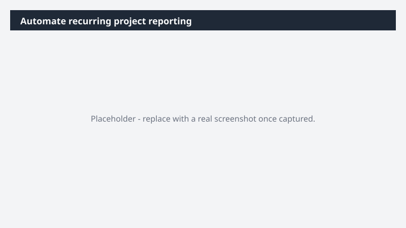

# Automate recurring project reporting

Replace the manual "pull the board, write the update, send it out" Monday-morning cycle with a status update that writes and sends itself.

> ⚠ **Draft recipe — not yet verified.** This prompt is reproduced from the Microsoft Copilot Cowork Task Pack for All Functions. It has not been run against our tenant, so the output described below is the pack's stated expectation rather than an observed result. Validate before relying on it.

## Business value

Replace the manual "pull the board, write the update, send it out" Monday-morning cycle with a status update that writes and sends itself. A recurring stakeholder update - drafted from real board data and delivered on cadence - so progress, risks, and deadlines stay visible without anyone chasing them.

## What it does

A recurring stakeholder update - drafted from real board data and delivered on cadence - so progress, risks, and deadlines stay visible without anyone chasing them.

## Prerequisites

- Microsoft 365 Copilot licence with access to Cowork
- monday.com plugin enabled and connected to your workspace

## Step-by-step

1. Open Cowork and start a new task.
2. Confirm the required plugin is turned on under **+ > Customize**: monday.com plugin enabled and connected to your workspace.
3. Paste the prompt from `prompt.md`, replacing anything in square brackets with your own values.
4. Review the plan Cowork proposes before letting it run.
5. Check any drafted email or calendar change before approving it — the prompt holds them for review rather than sending.

## How Cowork works through it

1. Monday.com → Pull current board state
2. Compare → Changes since last update
3. Identify → Upcoming deadlines + risks
4. Summarize → Health + progress narrative
5. Draft → Stakeholder update email
6. Skill → Save as recurring workflow
7. Schedule → Send every other Monday

## Expected output

A recurring stakeholder update - drafted from real board data and delivered on cadence - so progress, risks, and deadlines stay visible without anyone chasing them.

## Source

Adapted from the **Microsoft Copilot Cowork Task Pack for All Functions**, a task pack Microsoft publishes for customers. The prompt is reproduced as published; the surrounding recipe metadata, process tagging, and guidance are the Cookbook's.

## Skills used

OOTB: Email, Scheduling, Communications

Plugin: monday-com

## License

CC-BY-4.0 — see repo `LICENSE`.
