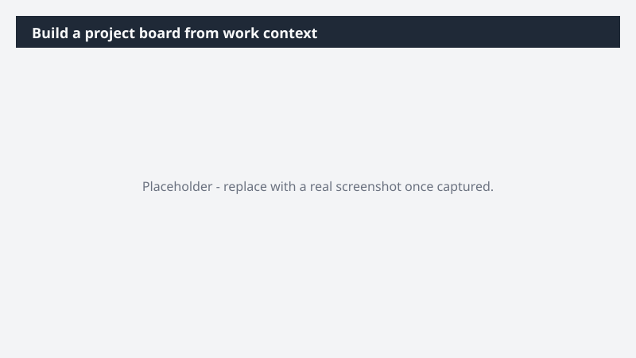

# Build a project board from work context

Spin up a fully scoped project board without the manual setup tax - no copying from emails, chasing owners, or piecing together task lists from scattered threads.

> ⚠ **Draft recipe — not yet verified.** This prompt is reproduced from the Microsoft Copilot Cowork Task Pack for All Functions. It has not been run against our tenant, so the output described below is the pack's stated expectation rather than an observed result. Validate before relying on it.

## Business value

Spin up a fully scoped project board without the manual setup tax - no copying from emails, chasing owners, or piecing together task lists from scattered threads. A ready-to-run Monday.com board grounded in your actual work - with owners, statuses, and priorities already in place so the team can pick it up and move.

## What it does

A ready-to-run Monday.com board grounded in your actual work - with owners, statuses, and priorities already in place so the team can pick it up and move.

## Prerequisites

- Microsoft 365 Copilot licence with access to Cowork
- monday.com plugin enabled and connected to your workspace

## Step-by-step

1. Open Cowork and start a new task.
2. Confirm the required plugin is turned on under **+ > Customize**: monday.com plugin enabled and connected to your workspace.
3. Paste the prompt from `prompt.md`, replacing anything in square brackets with your own values.
4. Review the plan Cowork proposes before letting it run.
5. Check any drafted email or calendar change before approving it — the prompt holds them for review rather than sending.

## How Cowork works through it

1. Email + Teams + files → Identify scope and stakeholders
2. Extract → Outstanding tasks and dependencies
3. Cluster → Tasks by workstream
4. Assign → Owner + status + priority
5. Structure → Board schema and groupings
6. Monday.com → Create new project board
7. Populate → Tasks with all metadata

## Expected output

A ready-to-run Monday.com board grounded in your actual work - with owners, statuses, and priorities already in place so the team can pick it up and move.

## Source

Adapted from the **Microsoft Copilot Cowork Task Pack for All Functions**, a task pack Microsoft publishes for customers. The prompt is reproduced as published; the surrounding recipe metadata, process tagging, and guidance are the Cookbook's.

## Skills used

OOTB: Email, Communications

Plugin: monday-com

## License

CC-BY-4.0 — see repo `LICENSE`.
