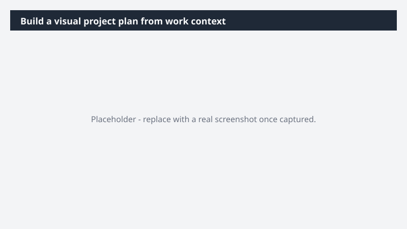

# Build a visual project plan from work context

Turn a scattered project picture - emails, meetings, files - into a single visual plan the team can rally around without rebuilding it from scratch.

> ⚠ **Draft recipe — not yet verified.** This prompt is reproduced from the Microsoft Copilot Cowork Task Pack for All Functions. It has not been run against our tenant, so the output described below is the pack's stated expectation rather than an observed result. Validate before relying on it.

## Business value

Turn a scattered project picture - emails, meetings, files - into a single visual plan the team can rally around without rebuilding it from scratch. A Miro board that maps the project end-to-end, with workstreams, milestones, and ownership visualized in one place - paired with a tracking table the team can update as work moves forward.

## What it does

A Miro board that maps the project end-to-end, with workstreams, milestones, and ownership visualized in one place - paired with a tracking table the team can update as work moves forward.

## Prerequisites

- Microsoft 365 Copilot licence with access to Cowork
- Miro plugin enabled and connected to your workspace

## Step-by-step

1. Open Cowork and start a new task.
2. Confirm the required plugin is turned on under **+ > Customize**: Miro plugin enabled and connected to your workspace.
3. Paste the prompt from `prompt.md`, replacing anything in square brackets with your own values.
4. Review the plan Cowork proposes before letting it run.
5. Check any drafted email or calendar change before approving it — the prompt holds them for review rather than sending.

## How Cowork works through it

1. Email + meetings + files → Identify workstreams + dependencies
2. Extract → Milestones, owners, due dates
3. Structure → Timeline or swim lane layout
4. Miro → Build visual project plan
5. Generate → Companion data table
6. Pre-fill → Inferred owners + statuses
7. Surface → Board ready for team input

## Expected output

A Miro board that maps the project end-to-end, with workstreams, milestones, and ownership visualized in one place - paired with a tracking table the team can update as work moves forward.

## Source

Adapted from the **Microsoft Copilot Cowork Task Pack for All Functions**, a task pack Microsoft publishes for customers. The prompt is reproduced as published; the surrounding recipe metadata, process tagging, and guidance are the Cookbook's.

## Skills used

OOTB: Email, Meetings

Plugin: miro

## License

CC-BY-4.0 — see repo `LICENSE`.
