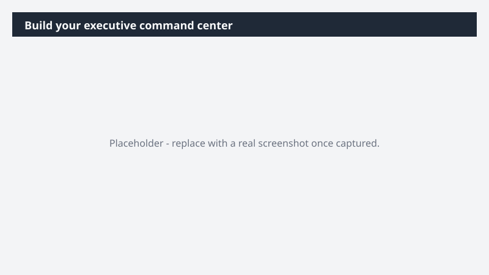

# Build your executive command center

Start every day knowing exactly where to focus - without scrolling through emails, meetings, and chats to triangulate it yourself.

> ⚠ **Draft recipe — not yet verified.** This prompt is reproduced from the Microsoft Copilot Cowork Task Pack for All Functions. It has not been run against our tenant, so the output described below is the pack's stated expectation rather than an observed result. Validate before relying on it.

> **Tip.** Note: With the Fabric IQ plugin, Cowork can access your live business metrics and KPIs - grounding the command center in real performance data alongside your activity signals.

## Business value

Start every day knowing exactly where to focus - without scrolling through emails, meetings, and chats to triangulate it yourself. A personal, interactive HTML command center that surfaces what needs your attention this week, where your time is going, and one or two prescriptive recommendations grounded in real signal patterns.

## What it does

A personal, interactive HTML command center that surfaces what needs your attention this week, where your time is going, and one or two prescriptive recommendations grounded in real signal patterns.

## Prerequisites

- Microsoft 365 Copilot licence with access to Cowork
- Fabric IQ plugin enabled in your Cowork session

## Step-by-step

1. Open Cowork and start a new task.
2. Confirm the required plugin is turned on under **+ > Customize**: Fabric IQ plugin enabled in your Cowork session.
3. Paste the prompt from `prompt.md`, replacing anything in square brackets with your own values.
4. Review the plan Cowork proposes before letting it run.
5. Check any drafted email or calendar change before approving it — the prompt holds them for review rather than sending.

## How Cowork works through it

1. Calendar + email + Teams → Map weekly load and signals
2. Fabric IQ → Pull business metrics and KPIs
3. Detect → Urgent items, conflicts, overdue threads
4. Cluster → People interaction patterns
5. Recommend → Dial up / dial down / re-engage
6. Build → Interactive HTML dashboard
7. Surface → Single-page artifact for daily use

## Expected output

A personal, interactive HTML command center that surfaces what needs your attention this week, where your time is going, and one or two prescriptive recommendations grounded in real signal patterns.

## Source

Adapted from the **Microsoft Copilot Cowork Task Pack for All Functions**, a task pack Microsoft publishes for customers. The prompt is reproduced as published; the surrounding recipe metadata, process tagging, and guidance are the Cookbook's.

## Skills used

OOTB: Meetings

Plugin: fabric-iq

## License

CC-BY-4.0 — see repo `LICENSE`.
