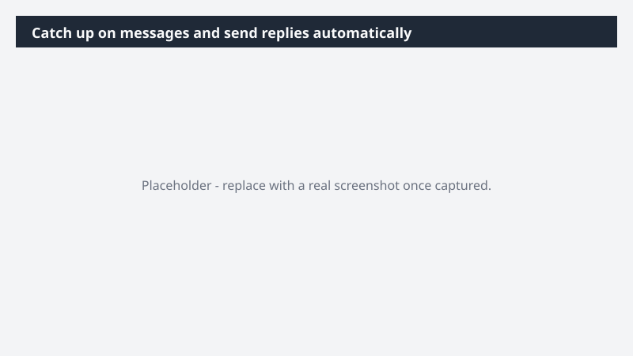

# Catch up on messages and send replies automatically

Close the loop on unanswered questions without scrolling back through a week of threads.

> ⚠ **Draft recipe — not yet verified.** This prompt is reproduced from the Microsoft Copilot Cowork Task Pack for All Functions. It has not been run against our tenant, so the output described below is the pack's stated expectation rather than an observed result. Validate before relying on it.

## Business value

Close the loop on unanswered questions without scrolling back through a week of threads. Routine acknowledgments handled automatically, higher-stakes replies drafted for review - so you stay responsive without spending hours catching up.

## What it does

Routine acknowledgments handled automatically, higher-stakes replies drafted for review - so you stay responsive without spending hours catching up.

## Prerequisites

- Microsoft 365 Copilot licence with access to Cowork

## Step-by-step

1. Open Cowork and start a new task.
2. Paste the prompt from `prompt.md`, replacing anything in square brackets with your own values.
3. Review the plan Cowork proposes before letting it run.
4. Check any drafted email or calendar change before approving it — the prompt holds them for review rather than sending.

## How Cowork works through it

1. Email + Teams → Scan weekly conversations
2. Detect → Direct questions without response
3. Classify → Acknowledgment vs. substantive reply
4. Generate → Quick acknowledgment responses
5. Draft → Substantive replies for review
6. Auto-send → Low-risk acknowledgments
7. Surface → Drafted replies for approval

## Expected output

Routine acknowledgments handled automatically, higher-stakes replies drafted for review - so you stay responsive without spending hours catching up.

## Source

Adapted from the **Microsoft Copilot Cowork Task Pack for All Functions**, a task pack Microsoft publishes for customers. The prompt is reproduced as published; the surrounding recipe metadata, process tagging, and guidance are the Cookbook's.

## Skills used

OOTB: Email, Communications

Plugin: none required

## License

CC-BY-4.0 — see repo `LICENSE`.
