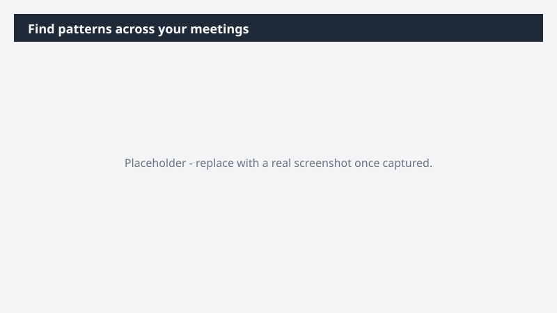

# Find patterns across your meetings

Surface the themes that are repeating across your meetings - without re-listening, re-reading transcripts, or relying on memory.

> ⚠ **Draft recipe — not yet verified.** This prompt is reproduced from the Microsoft Copilot Cowork Task Pack for All Functions. It has not been run against our tenant, so the output described below is the pack's stated expectation rather than an observed result. Validate before relying on it.

## Business value

Surface the themes that are repeating across your meetings - without re-listening, re-reading transcripts, or relying on memory. A pattern report identifying the most common themes across your recent meetings, with representative quotes, the meetings where each came up, and a recommended action for each.

## What it does

A pattern report identifying the most common themes across your recent meetings, with representative quotes, the meetings where each came up, and a recommended action for each.

## Prerequisites

- Microsoft 365 Copilot licence with access to Cowork

## Step-by-step

1. Open Cowork and start a new task.
2. Paste the prompt from `prompt.md`, replacing anything in square brackets with your own values.
3. Review the plan Cowork proposes before letting it run.
4. Check any drafted email or calendar change before approving it — the prompt holds them for review rather than sending.

## How Cowork works through it

1. TeamsMaestro → Pull all [meeting type] from [time window]
2. Analyze → Extract recurring themes across meetings
3. Rank → Themes by frequency
4. Capture → Representative quotes + source meetings per theme
5. Recommend → Specific action per theme
6. Deliver → Structured pattern report

## Expected output

A pattern report identifying the most common themes across your recent meetings, with representative quotes, the meetings where each came up, and a recommended action for each.

## Source

Adapted from the **Microsoft Copilot Cowork Task Pack for All Functions**, a task pack Microsoft publishes for customers. The prompt is reproduced as published; the surrounding recipe metadata, process tagging, and guidance are the Cookbook's.

## Skills used

OOTB: Scheduling, Meetings

Plugin: none required

## License

CC-BY-4.0 — see repo `LICENSE`.
