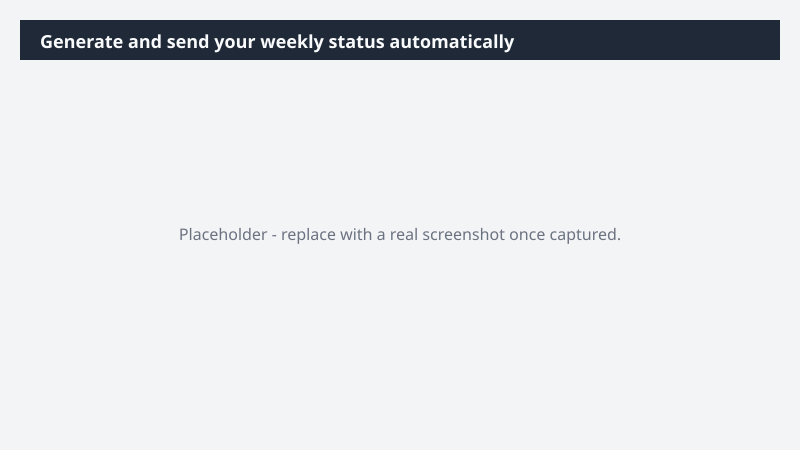

# Generate and send your weekly status automatically

Replace the Monday-morning scramble with a status update that writes itself.

> ⚠ **Draft recipe — not yet verified.** This prompt is reproduced from the Microsoft Copilot Cowork Task Pack for All Functions. It has not been run against our tenant, so the output described below is the pack's stated expectation rather than an observed result. Validate before relying on it.

> **Tip.** Note: This task features skill creation for repeatable processes. For a detailed description of each skill, see Cowork skills. Note: With the Fabric IQ plugin, Cowork can access live metrics tied to your priorities - grounding the weekly status in real numbers alongside your meetings and conversations.

## Business value

Replace the Monday-morning scramble with a status update that writes itself. A ready-to-send weekly status, drafted from your real meetings and conversations, that lands in your team's inbox to start the week.

## What it does

A ready-to-send weekly status, drafted from your real meetings and conversations, that lands in your team's inbox to start the week.

## Prerequisites

- Microsoft 365 Copilot licence with access to Cowork
- Fabric IQ plugin enabled in your Cowork session

## Step-by-step

1. Open Cowork and start a new task.
2. Confirm the required plugin is turned on under **+ > Customize**: Fabric IQ plugin enabled in your Cowork session.
3. Paste the prompt from `prompt.md`, replacing anything in square brackets with your own values.
4. Review the plan Cowork proposes before letting it run.
5. Check any drafted email or calendar change before approving it — the prompt holds them for review rather than sending.

## How Cowork works through it

1. Calendar → Identify key meetings
2. Email → Extract top-of-mind priorities
3. Teams → Capture project updates
4. Fabric IQ → Pull priority metrics + weekly progress
5. Summarize → Draft weekly status
6. Validate → Highlight exec-level meetings
7. Approve → Review draft
8. Schedule → Send every Monday morning

## Expected output

A ready-to-send weekly status, drafted from your real meetings and conversations, that lands in your team's inbox to start the week.

## Source

Adapted from the **Microsoft Copilot Cowork Task Pack for All Functions**, a task pack Microsoft publishes for customers. The prompt is reproduced as published; the surrounding recipe metadata, process tagging, and guidance are the Cookbook's.

## Skills used

OOTB: Email, Scheduling, Meetings

Plugin: fabric-iq

## License

CC-BY-4.0 — see repo `LICENSE`.
