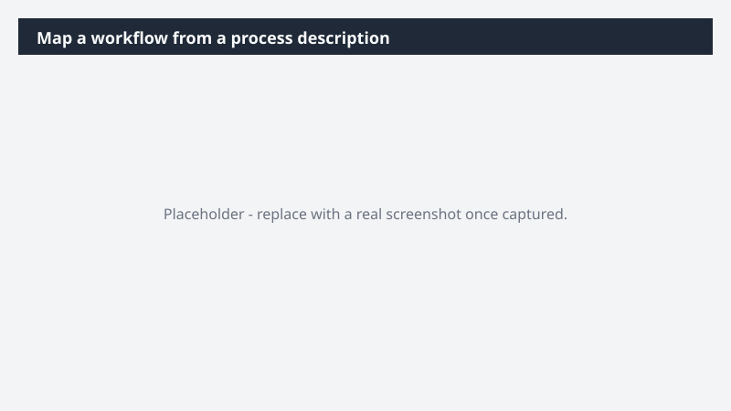

# Map a workflow from a process description

Make a workflow shareable, reviewable, and improvable - without spending hours building the diagram by hand.

> ⚠ **Draft recipe — not yet verified.** This prompt is reproduced from the Microsoft Copilot Cowork Task Pack for All Functions. It has not been run against our tenant, so the output described below is the pack's stated expectation rather than an observed result. Validate before relying on it.

## Business value

Make a workflow shareable, reviewable, and improvable - without spending hours building the diagram by hand. A clear Miro flowchart of the process, paired with a narrative doc that captures purpose, ownership, handoffs, and risks - turning tribal knowledge into an artifact the team can act on.

## What it does

A clear Miro flowchart of the process, paired with a narrative doc that captures purpose, ownership, handoffs, and risks - turning tribal knowledge into an artifact the team can act on.

## Prerequisites

- Microsoft 365 Copilot licence with access to Cowork
- Miro plugin enabled and connected to your workspace

## Step-by-step

1. Open Cowork and start a new task.
2. Confirm the required plugin is turned on under **+ > Customize**: Miro plugin enabled and connected to your workspace.
3. Paste the prompt from `prompt.md`, replacing anything in square brackets with your own values.
4. Review the plan Cowork proposes before letting it run.
5. Check any drafted email or calendar change before approving it — the prompt holds them for review rather than sending.

## How Cowork works through it

1. Source → Extract process steps + owners
2. Identify → Decision points + handoffs
3. Structure → Flowchart layout
4. Miro → Build labeled diagram
5. Generate → Companion narrative doc
6. Flag → Risks + bottlenecks
7. Surface → Workflow ready for review

## Expected output

A clear Miro flowchart of the process, paired with a narrative doc that captures purpose, ownership, handoffs, and risks - turning tribal knowledge into an artifact the team can act on.

## Source

Adapted from the **Microsoft Copilot Cowork Task Pack for All Functions**, a task pack Microsoft publishes for customers. The prompt is reproduced as published; the surrounding recipe metadata, process tagging, and guidance are the Cookbook's.

## Skills used

OOTB: Meetings

Plugin: miro

## License

CC-BY-4.0 — see repo `LICENSE`.
