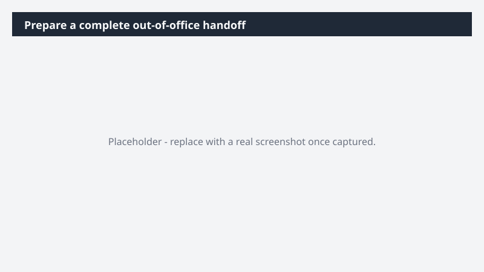

# Prepare a complete out-of-office handoff

Step away from your laptop knowing nothing in flight will stall while you are out.

> ⚠ **Draft recipe — not yet verified.** This prompt is reproduced from the Microsoft Copilot Cowork Task Pack for All Functions. It has not been run against our tenant, so the output described below is the pack's stated expectation rather than an observed result. Validate before relying on it.

## Business value

Step away from your laptop knowing nothing in flight will stall while you are out. A handover document built from your real work - projects, owners, deadlines, and supporting files - so coverage stays clear and execution keeps moving.

## What it does

A handover document built from your real work - projects, owners, deadlines, and supporting files - so coverage stays clear and execution keeps moving.

## Prerequisites

- Microsoft 365 Copilot licence with access to Cowork

## Step-by-step

1. Open Cowork and start a new task.
2. Paste the prompt from `prompt.md`, replacing anything in square brackets with your own values.
3. Review the plan Cowork proposes before letting it run.
4. Check any drafted email or calendar change before approving it — the prompt holds them for review rather than sending.

## How Cowork works through it

1. Meetings (this week) → Identify active projects + stakeholders
2. Email threads → Extract open requests + dependencies
3. Teams chats → Capture in-flight tasks
4. Calendar (next week) → Detect upcoming deadlines
5. Org directory → Match internal team coverage
6. Files → Link supporting documents
7. Compile → Ownership-assigned handover tracker
8. Calendar → Set auto-reply, decline/ delegate meetings, flag owned meetings

## Expected output

A handover document built from your real work - projects, owners, deadlines, and supporting files - so coverage stays clear and execution keeps moving.

## Source

Adapted from the **Microsoft Copilot Cowork Task Pack for All Functions**, a task pack Microsoft publishes for customers. The prompt is reproduced as published; the surrounding recipe metadata, process tagging, and guidance are the Cookbook's.

## Skills used

OOTB: Email, Calendar Management, Meetings, Communications

Plugin: none required

## License

CC-BY-4.0 — see repo `LICENSE`.
