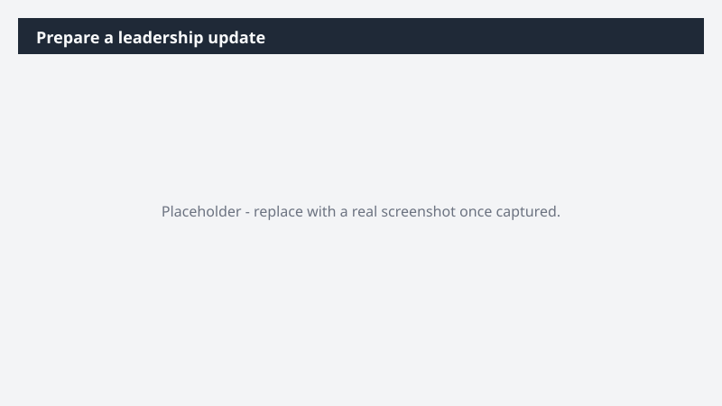

# Prepare a leadership update

Walk into a leadership update with a deck that's on-brand, on-message, and grounded in your team's real work - without rebuilding it from scratch every cycle.

> ⚠ **Draft recipe — not yet verified.** This prompt is reproduced from the Microsoft Copilot Cowork Task Pack for All Functions. It has not been run against our tenant, so the output described below is the pack's stated expectation rather than an observed result. Validate before relying on it.

## Business value

Walk into a leadership update with a deck that's on-brand, on-message, and grounded in your team's real work - without rebuilding it from scratch every cycle. A leadership-ready deck in Templafy using your organization's approved templates and brand standards - covering progress, priorities, and the outlook ahead - sourced from your real work context.

## What it does

A leadership-ready deck in Templafy using your organization's approved templates and brand standards - covering progress, priorities, and the outlook ahead - sourced from your real work context.

## Prerequisites

- Microsoft 365 Copilot licence with access to Cowork

## Step-by-step

1. Open Cowork and start a new task.
2. Paste the prompt from `prompt.md`, replacing anything in square brackets with your own values.
3. Review the plan Cowork proposes before letting it run.
4. Check any drafted email or calendar change before approving it — the prompt holds them for review rather than sending.

## How Cowork works through it

1. Email + meetings + files → Pull recent work context for [Topic]
2. Synthesize → Progress, priorities, risks, decisions needed
3. Structure → Opening · core priorities · status · closing ask
4. Review gate → Surface deck structure before building
5. Templafy → Build [X]-slide deck on approved corporate template
6. Refine → Executive tone, tight language
7. Deliver → Leadership-ready deck

## Expected output

A leadership-ready deck in Templafy using your organization's approved templates and brand standards - covering progress, priorities, and the outlook ahead - sourced from your real work context.

## Source

Adapted from the **Microsoft Copilot Cowork Task Pack for All Functions**, a task pack Microsoft publishes for customers. The prompt is reproduced as published; the surrounding recipe metadata, process tagging, and guidance are the Cookbook's.

## Skills used

OOTB: PowerPoint, Email, Meetings

Plugin: none required

## License

CC-BY-4.0 — see repo `LICENSE`.
