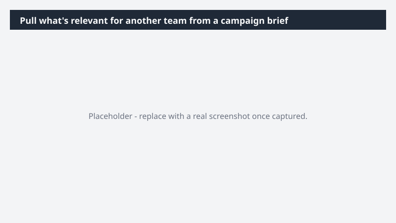

# Pull what's relevant for another team from a campaign brief

Get a partner team only the parts of a campaign brief that apply to them - without making them read the whole thing to find their section.

> ⚠ **Draft recipe — not yet verified.** This prompt is reproduced from the Microsoft Copilot Cowork Task Pack for Marketing. It has not been run against our tenant, so the output described below is the pack's stated expectation rather than an observed result. Validate before relying on it.

## Business value

Get a partner team only the parts of a campaign brief that apply to them - without making them read the whole thing to find their section. A focused doc containing just the sections relevant to the receiving team, saved in Box and shared with the right group.

## What it does

A focused doc containing just the sections relevant to the receiving team, saved in Box and shared with the right group.

## Prerequisites

- Microsoft 365 Copilot licence with access to Cowork

## Step-by-step

1. Open Cowork and start a new task.
2. Paste the prompt from `prompt.md`, replacing anything in square brackets with your own values.
3. Review the plan Cowork proposes before letting it run.
4. Check any drafted email or calendar change before approving it — the prompt holds them for review rather than sending.

## How Cowork works through it

1. Box → Open and read the full campaign brief
2. Identify → Sections relevant to [Mobile App Team]
3. Extract → Pull sections with headings and wording intact
4. Box → Create new focused doc and save in Box
5. Share → Deliver to [Mobile App Team distribution]

## Expected output

A focused doc containing just the sections relevant to the receiving team, saved in Box and shared with the right group.

## Source

Adapted from the **Microsoft Copilot Cowork Task Pack for Marketing**, a task pack Microsoft publishes for customers. The prompt is reproduced as published; the surrounding recipe metadata, process tagging, and guidance are the Cookbook's.

## Skills used

OOTB: —

Plugin: none required

## License

CC-BY-4.0 — see repo `LICENSE`.
