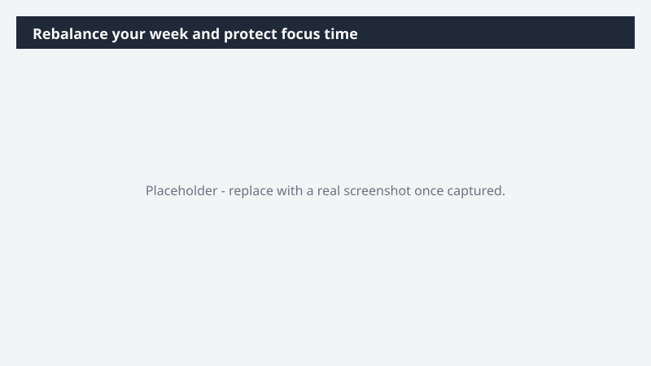

# Rebalance your week and protect focus time

Take control of a fragmented calendar before it takes control of your week.

> ⚠ **Draft recipe — not yet verified.** This prompt is reproduced from the Microsoft Copilot Cowork Task Pack for All Functions. It has not been run against our tenant, so the output described below is the pack's stated expectation rather than an observed result. Validate before relying on it.

> **Tip.** Note: You can schedule this to run automatically by starting your prompt with "Create a skill where this occurs every Monday morning."

## Business value

Take control of a fragmented calendar before it takes control of your week. A rebalanced schedule that protects focus time, prioritizes high-impact meetings, and resolves conflicts - without manually negotiating your own availability.

## What it does

A rebalanced schedule that protects focus time, prioritizes high-impact meetings, and resolves conflicts - without manually negotiating your own availability.

## Prerequisites

- Microsoft 365 Copilot licence with access to Cowork

## Step-by-step

1. Open Cowork and start a new task.
2. Paste the prompt from `prompt.md`, replacing anything in square brackets with your own values.
3. Review the plan Cowork proposes before letting it run.
4. Check any drafted email or calendar change before approving it — the prompt holds them for review rather than sending.

## How Cowork works through it

1. Calendar → Summarize meeting load + focus time
2. Clarify → Weekly goals + constraints
3. Evaluate → Meeting impact + conflicts
4. Propose → Accept / decline / reschedule
5. Recommend → Add focus blocks
6. Approve → Proposed changes
7. Execute → Apply updates one-by-one

## Expected output

A rebalanced schedule that protects focus time, prioritizes high-impact meetings, and resolves conflicts - without manually negotiating your own availability.

## Source

Adapted from the **Microsoft Copilot Cowork Task Pack for All Functions**, a task pack Microsoft publishes for customers. The prompt is reproduced as published; the surrounding recipe metadata, process tagging, and guidance are the Cookbook's.

## Skills used

OOTB: Email, Calendar Management, Scheduling, Meetings

Plugin: none required

## License

CC-BY-4.0 — see repo `LICENSE`.
