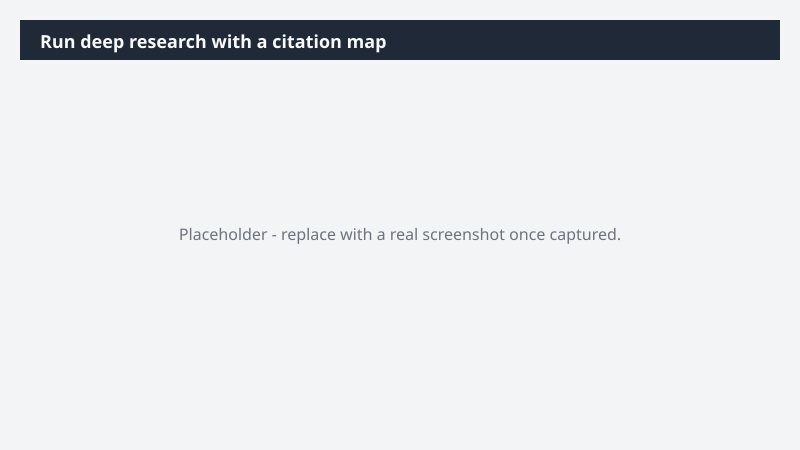

# Run deep research with a citation map

Read a full folder of source documents and produce a brief you can act on - key findings, conflicts, and the strongest insights surfaced, each traceable to its source.

> ⚠ **Draft recipe — not yet verified.** This prompt is reproduced from the Microsoft Copilot Cowork Task Pack for All Functions. It has not been run against our tenant, so the output described below is the pack's stated expectation rather than an observed result. Validate before relying on it.

> **Tip.** Note: With the Fabric IQ plugin, Cowork can access your live business data - validating research findings against real metrics alongside the source documents.

## Business value

Read a full folder of source documents and produce a brief you can act on - key findings, conflicts, and the strongest insights surfaced, each traceable to its source. A structured research artifact grounded in every source document, with a clickable citation map linking each insight back to the original file. Conflicts, gaps, and the three strongest findings surfaced explicitly.

## What it does

A structured research artifact grounded in every source document, with a clickable citation map linking each insight back to the original file. Conflicts, gaps, and the three strongest findings surfaced explicitly.

## Prerequisites

- Microsoft 365 Copilot licence with access to Cowork
- Fabric IQ plugin enabled in your Cowork session

## Step-by-step

1. Open Cowork and start a new task.
2. Confirm the required plugin is turned on under **+ > Customize**: Fabric IQ plugin enabled in your Cowork session.
3. Paste the prompt from `prompt.md`, replacing anything in square brackets with your own values.
4. Review the plan Cowork proposes before letting it run.
5. Check any drafted email or calendar change before approving it — the prompt holds them for review rather than sending.

## How Cowork works through it

1. Folder → Read every source document
2. Extract → Claims, evidence, context
3. Fabric IQ → Validate findings against live business data
4. Compare → Conflicts and consistencies across sources
5. Synthesize → Structured brief with three core insights
6. Map → Citation back to source and page
7. Flag → Gaps and missing context

## Expected output

A structured research artifact grounded in every source document, with a clickable citation map linking each insight back to the original file. Conflicts, gaps, and the three strongest findings surfaced explicitly.

## Source

Adapted from the **Microsoft Copilot Cowork Task Pack for All Functions**, a task pack Microsoft publishes for customers. The prompt is reproduced as published; the surrounding recipe metadata, process tagging, and guidance are the Cookbook's.

## Skills used

OOTB: Deep Research

Plugin: fabric-iq

## License

CC-BY-4.0 — see repo `LICENSE`.
