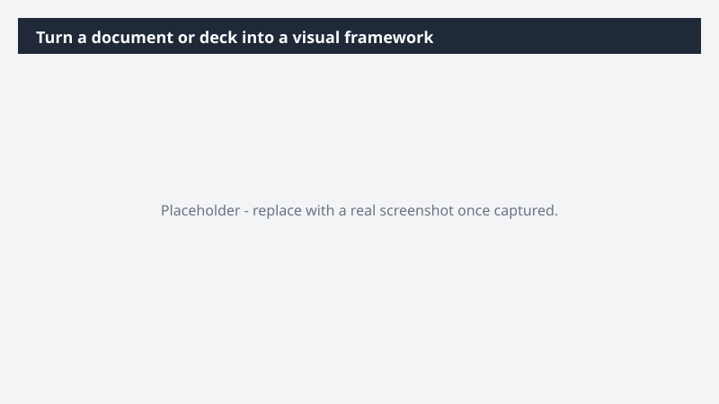

# Turn a document or deck into a visual framework

Take dense, written content and turn it into a clear visual the team can actually engage with - without spending the afternoon redrawing it by hand.

> ⚠ **Draft recipe — not yet verified.** This prompt is reproduced from the Microsoft Copilot Cowork Task Pack for All Functions. It has not been run against our tenant, so the output described below is the pack's stated expectation rather than an observed result. Validate before relying on it.

## Business value

Take dense, written content and turn it into a clear visual the team can actually engage with - without spending the afternoon redrawing it by hand. A Miro visual - flowchart, mindmap, or framework diagram - that translates the source content into a clean, presentation-ready format.

## What it does

A Miro visual - flowchart, mindmap, or framework diagram - that translates the source content into a clean, presentation-ready format.

## Prerequisites

- Microsoft 365 Copilot licence with access to Cowork
- Miro plugin enabled and connected to your workspace

## Step-by-step

1. Open Cowork and start a new task.
2. Confirm the required plugin is turned on under **+ > Customize**: Miro plugin enabled and connected to your workspace.
3. Paste the prompt from `prompt.md`, replacing anything in square brackets with your own values.
4. Review the plan Cowork proposes before letting it run.
5. Check any drafted email or calendar change before approving it — the prompt holds them for review rather than sending.

## How Cowork works through it

1. Source → Read full document or deck
2. Identify → Core structure + relationships
3. Select → Best-fit visual format
4. Map → Content to shapes + frames
5. Miro → Build visual layout
6. Refine → Clean, presentation-ready output

## Expected output

A Miro visual - flowchart, mindmap, or framework diagram - that translates the source content into a clean, presentation-ready format.

## Source

Adapted from the **Microsoft Copilot Cowork Task Pack for All Functions**, a task pack Microsoft publishes for customers. The prompt is reproduced as published; the surrounding recipe metadata, process tagging, and guidance are the Cookbook's.

## Skills used

OOTB: PowerPoint

Plugin: miro

## License

CC-BY-4.0 — see repo `LICENSE`.
