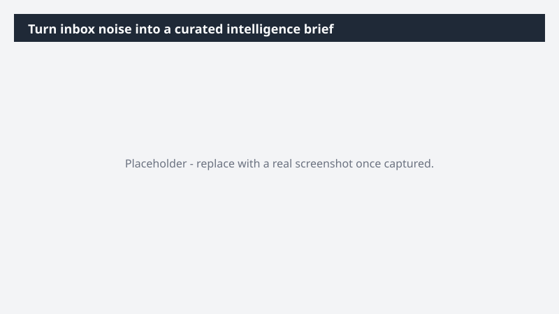

# Turn inbox noise into a curated intelligence brief

Cut through a week of newsletters to the stories that actually matter to your work.

> ⚠ **Draft recipe — not yet verified.** This prompt is reproduced from the Microsoft Copilot Cowork Task Pack for All Functions. It has not been run against our tenant, so the output described below is the pack's stated expectation rather than an observed result. Validate before relying on it.

> **Tip.** Note: This task features a scheduled prompt, which tells Cowork you want it to run automatically on a recurring basis. To create a scheduled prompt, simply describe what you want and when in your message.

## Business value

Cut through a week of newsletters to the stories that actually matter to your work. A curated weekly brief that surfaces meaningful trends across the publications you follow - without the time spent reading them.

## What it does

A curated weekly brief that surfaces meaningful trends across the publications you follow - without the time spent reading them.

## Prerequisites

- Microsoft 365 Copilot licence with access to Cowork

## Step-by-step

1. Open Cowork and start a new task.
2. Paste the prompt from `prompt.md`, replacing anything in square brackets with your own values.
3. Review the plan Cowork proposes before letting it run.
4. Check any drafted email or calendar change before approving it — the prompt holds them for review rather than sending.

## How Cowork works through it

1. Inbox → Identify newsletters + digests
2. Categorize → Internal / AI / news / industry
3. Filter → Exclude consumer content
4. Synthesize → Narrative brief
5. Compile → Inline article
6. Link → Source emails
7. Research → Deep dive on top headlines
8. Send → Every Friday afternoon

## Expected output

A curated weekly brief that surfaces meaningful trends across the publications you follow - without the time spent reading them.

## Source

Adapted from the **Microsoft Copilot Cowork Task Pack for All Functions**, a task pack Microsoft publishes for customers. The prompt is reproduced as published; the surrounding recipe metadata, process tagging, and guidance are the Cookbook's.

## Skills used

OOTB: Email, Scheduling, Deep Research

Plugin: none required

## License

CC-BY-4.0 — see repo `LICENSE`.
