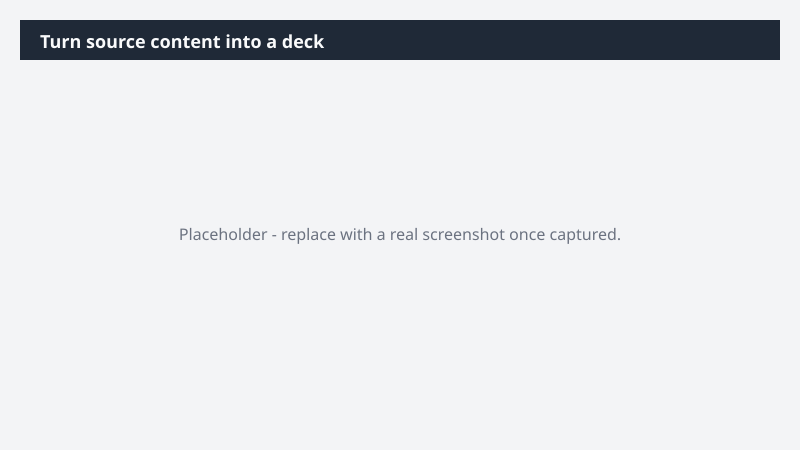

# Turn source content into a deck

Get a working deck built from content you already have - without starting from a blank slide.

> ⚠ **Draft recipe — not yet verified.** This prompt is reproduced from the Microsoft Copilot Cowork Task Pack for All Functions. It has not been run against our tenant, so the output described below is the pack's stated expectation rather than an observed result. Validate before relying on it.

## Business value

Get a working deck built from content you already have - without starting from a blank slide. A ready-to-present Prezi deck built from your source content, structured into clear sections with visuals applied.

## What it does

A ready-to-present Prezi deck built from your source content, structured into clear sections with visuals applied.

## Prerequisites

- Microsoft 365 Copilot licence with access to Cowork
- Prezi plugin enabled and connected to your account

## Step-by-step

1. Open Cowork and start a new task.
2. Confirm the required plugin is turned on under **+ > Customize**: Prezi plugin enabled and connected to your account.
3. Paste the prompt from `prompt.md`, replacing anything in square brackets with your own values.
4. Review the plan Cowork proposes before letting it run.
5. Check any drafted email or calendar change before approving it — the prompt holds them for review rather than sending.

## How Cowork works through it

1. Source → Read full content
2. Identify → Key points and main themes
3. Structure → Title · sections · next steps
4. Prezi → Build [X]-slide deck with visual treatment
5. Refine → Tight language, structure-led narrative

## Expected output

A ready-to-present Prezi deck built from your source content, structured into clear sections with visuals applied.

## Source

Adapted from the **Microsoft Copilot Cowork Task Pack for All Functions**, a task pack Microsoft publishes for customers. The prompt is reproduced as published; the surrounding recipe metadata, process tagging, and guidance are the Cookbook's.

## Skills used

OOTB: PowerPoint, Meetings

Plugin: prezi

## License

CC-BY-4.0 — see repo `LICENSE`.
