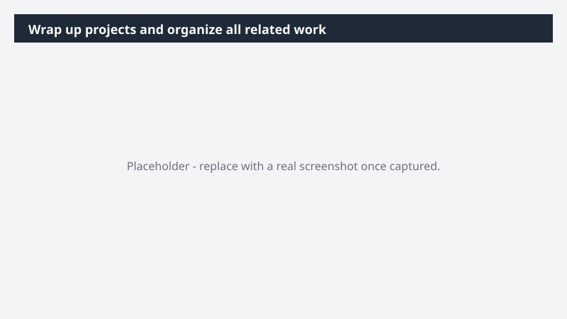

# Wrap up projects and organize all related work

Close out a project with a clean, shareable archive - not a scattered trail of files.

> ⚠ **Draft recipe — not yet verified.** This prompt is reproduced from the Microsoft Copilot Cowork Task Pack for All Functions. It has not been run against our tenant, so the output described below is the pack's stated expectation rather than an observed result. Validate before relying on it.

## Business value

Close out a project with a clean, shareable archive - not a scattered trail of files. A single OneDrive folder with the project's deliverables and references, shared with the team so the work stays findable and easy to reference.

## What it does

A single OneDrive folder with the project's deliverables and references, shared with the team so the work stays findable and easy to reference.

## Prerequisites

- Microsoft 365 Copilot licence with access to Cowork

## Step-by-step

1. Open Cowork and start a new task.
2. Paste the prompt from `prompt.md`, replacing anything in square brackets with your own values.
3. Review the plan Cowork proposes before letting it run.
4. Check any drafted email or calendar change before approving it — the prompt holds them for review rather than sending.

## How Cowork works through it

1. OneDrive → Locate project files
2. Classify → Docs / decks / spreadsheets
3. Create → Archive folder
4. Move → Related artifacts
5. Share → Archive folder
6. Confirm → Central project reference
7. Build → HTML project recap page for the archive

## Expected output

A single OneDrive folder with the project's deliverables and references, shared with the team so the work stays findable and easy to reference.

## Source

Adapted from the **Microsoft Copilot Cowork Task Pack for All Functions**, a task pack Microsoft publishes for customers. The prompt is reproduced as published; the surrounding recipe metadata, process tagging, and guidance are the Cookbook's.

## Skills used

OOTB: Excel

Plugin: none required

## License

CC-BY-4.0 — see repo `LICENSE`.
